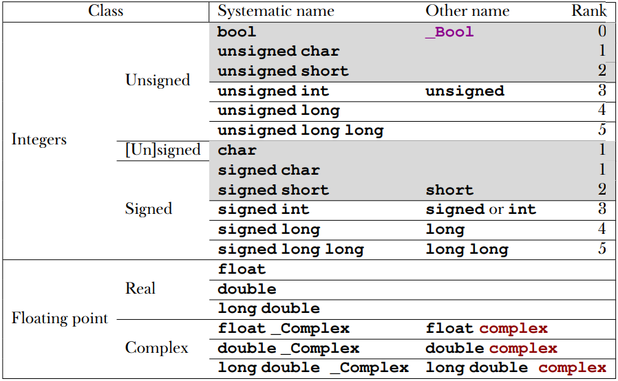
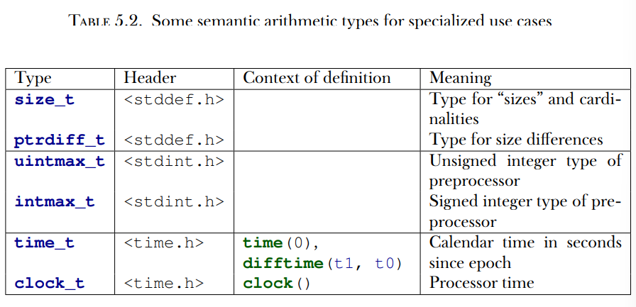
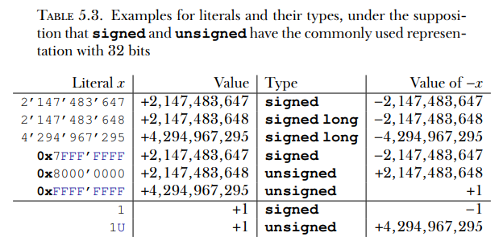

# **Capítulo 5 - Valores básicos e dados**

Esta seção abrange:
* Entendendo a máquina de estados abstratos
* Trabalhar com tipos e valores
* Inicialização de variáveis
* Utilização de constantes nomeadas
* Representações binárias de tipos

Agora mudaremos o foco de "como as coisas devem ser feitas" (declarações e expressões) para as coisas nas quais programas em C operam: valores e dados. Um programa concreto em uma instância no tempo tem que *representar* valores. Humanos possuem uma estratégia similar: hoje em dia, usamos uma representação decimal para escrever números em papel usando o sistema numérico Hindu-Arábico. Mas temos outros sistemas para escrever números: por exemplo, numerais romanos (I, II, III, IV ...) ou notação textual. Para saber que a palavra *doze* denota o valor 12 é um passo não-trivial e nos lembra que linguagens Europeias denotam números não apenas em decimais mas também em outros sistemas. Inglês e Alemão misturam com base 12, Francês com bases 16 e 20. Para falantes de Francês não-nativos, pode ser difícil de, espontaneamente, associar *quatre vingt quinze* (quatro vezes vinte e quinze) com o valor 95.

De maneira similar, representações de valores em um computador podem variar "culturalmente" de uma arquitetura para outra ou são determinados pelo tipo que o programador dá ao valor. Portanto, deveríamos tentar raciocinar primáriamente sobre valores e não sobre representações se quisermos escrever código portável.

Se você já tem alguma experiência em C e em manipulação de bytes e bits, precisará fazer um esforço para "esquecer" ativamente seu conhecimento para a maioria desta seção. Pensar sobre representações concretas de valores em seu computador irá dificultar (inhibit) mais do que ajudar.

A representação que um valor particular tem deveria, na maioria dos casos, não ser sua preocupação. O compilador está ali para organizar a tradução entre valores e representações.

Nesta seção, veremos como se espera que as diferentes partes desta 
tradução funcionem. O mundo ideal no qual você normalmente "discutirá" em seu programa é a máquina de estados abstratos de C (seção 5.1). Ela dá uma visão da execução do seu programa, que é na maior parte independente da plataforma na qual o programa é executado. Os componentes do *estado* desta máquina, os *objetos*, todos tem uma interpretação fixa (seu tipo) e um valor que varia no tempo. Os tipos básicos de C são descritos na subseção 5.2, seguidos por descrições de como podemos expressar valores específicos para estes tipos básicos (seção 5.3), como tipos são agrupados em expressões (seção 5.4), como podemos garantir que nossos objetos inicialmente tem os valores desejados (seção 5.5), como podemos dar nomes aos valores recorrentes (seção 5.6) e como tais valores são representados na máquina de estados abstratos (subseção 5.7).

## 5.1 A máquina de estados abstratos
Um programa em C pode ser visto como um tipo de máquina que manipula valores: os valores particulares que variáveis do programa tem em um determinado momento e valores intermediários que são resultado de expressões computadas. Vamos considerar um exemplo básico:
```
double x = 5.0;
double y = 3.0;
...
x = (x * 1.5) - y;
printf("x is \%g\n", x);
```

Aqui temos duas variáveis, x e y, que tem valores inicias 5.0 e 3.0, respectivamente. A terceira linha compita algumas expressões: a subexpressão `x` que avalia x e fornece o valor 5.0, `(5.0 * 1.5)` que resulta no valor 7.5, `y` que avalia y e fornece o valor 3.0, `7.5 - 3.0` que resulta em 4.5; `x = 4.5` que muda o valor de x para 4.5 e `x` que avalia x novamente mas agora fornece o valor 4.5 e printf("x is \%g\n", 4.5) que exibe uma linha de texto no terminal.

Nem todas as operações e seus valores resultantes são *observáveis* de dentro de seu programa. Eles são observáveis apenas se forem armazenados em uma memória *endereçável* ou escritos para um dispositivo de saída. No exemplo, até um certo ponro, a declaração printf 'observa' o que foi feito na linha anterior avaliando a variável x e então exibindo uma representação de string daquelel valor no terminal. Mas as outras subexpressões e seus resultados (como multiplicação e subtração) não são observáveis como tal, já que nunca definimos uma variável para armazenar esses valores.

O seu compilador C tem permissão de simplificar(shortcut) qualquer dos passos durante um processo chamado *otimização* apenas se garantir a realização dos resultados finais. Aqui, em nosso exemplo de brinquedo, existem basicamente duas possibilidades. A primeira é que a variável x não é usada mais tarde no programa, e seu valor adquirido só é relevante para a nossa declaração printf. Neste caso, o único efeito da nossa seção de código é exibir para o terminal, e o compilador pode (e vai) substituir a seção inteira com o equivalente `printf("x is 4.5\n");`. Isto é, todas as computações são feitas na hora da compilação, e o executável produzido só exibirá uma string fixa. Todo o código restante e mesmo as definições das variáveis desaparecem.

A outra possibilidade é que x pode ser usado mais tarde. Então um compilador decente faria algo como:
```
double x = 4.5;
prinft("x is 4.5\n");
```
ou
```
printf("x is 4.5\n");
double x = 4.5;
```

pois, para usar x em um momento posterior, não é relevante se a atribuição ocorreu antes ou depois de printf.

Para uma otimização ser válida, só é importante que um compilador C produza um executável que reproduza os *estados observáveis*. Estados observáveis consistem nos conteúdos de algumas variáveis (e entidades similares que veremos mais tarde) e a saída pois eles evoluem durante a execução do programa. Todo este mecanismo de mudança é chamado máquina de estados abstratos.

Para explicar a máquina de estados abstratos primeiro precisamos olhar os conceitos de um *valor* (qual estados estamos), *tipo* (o que este estado representa), e a *representação* (como o estado se distingue). Como o termo *abstratos* sugere, o mecanismo de C permite que diferentes plataformas realizem a máquina de estados abstratos de um dado programa de forma diferente de acordo com suas necessidades e capacidades. Esta permissividade é uma das chaves do potencial de otimização de C.

5.1.1 *Valores*. Um valor em C é uma entidade abstrata que geralmente existe além do seu programa, a implementação particular daquele programa e a representação do valor durante uma execução em particular do programa. Como um exemplo, o valor e conceito de 0 deveria e sempre terá os mesmos efeitos em todas as plataformas de C: acrescentar este valor a outro valor x será, novamente, x, e avaliar um valor 0 em uma expressão de controle sempre acionará o desdobramento false da declaração de controle.

Até aqui, a maioria de nossos exemplos foi com algum tipo de números. Isto não é um acidente; é relacionado a um dos principais conceitos de C: *Todos os valores são números ou se traduzem para números*. Esta propriedade abrange todos os valores dos quais tratam programas em C, sejam eles caracteres ou texto que exibimos, valores verdade, medidas feitas ou relações que investigamos. Pense nesses números como entidades matemáticas que são independentes do seu programa e sua realização concreta.

Os *dados* da execução de um programa consistem em todos os valores agrupados (assembled) de todos os objetos em um dado momento. O *estado* da execução de um programa é determinado por:
* O executável
* O ponto de execução atual
* O dado
* Intervenções externas, como IO do usuário

Se abstrairmos do último ponto, um executável que executa com os mesmos dados do mesmo ponto de execução deve retornar o mesmo resultado. Mas como programas em C deveriam ser portáveis através de sistemas, queremos mais que isso. Não queremos que o resultado de uma computação dependa do executável (que é específico de cada plataforma), mas idealmente dependa apenas na própria especificação do programa. Um passo importante para atingir esta independência de plataforma é o conceito de *tipos*.

5.1.2 *Tipos*. Um tipo é uma propriedade adicional que C associa com valores. Até agora, vimos vários desses tipos, predominantemente size_t, mas também double e bool. *Todos os valores tem um tipo determinado estáticamente*. *Operações possíveis em um valor são determinadas por seu tipo*. *O tipo de um valor determina os resultados de todas as operações*.

5.1.3 *Representação binária e a máquina de estados abstratos*. Infelizmente, a grande variedade de plataformas computacionais não é uma que permite que o padrão C possa impor completamente os resultados das operações em um dado tipo. Algumas coisas não especificadas completamente pelo padrão incluem, por exemplo, a precisão na qual uma operação de ponto flutuante com tipo double seja realizada (floating-point representation). C apenas impõe propriedades em representações de modo que os resultados das operações possam ser deduzidos a priori de duas fontes diferentes:
* Os valores dos operandos
* Alguns valores característicos que descrevem a plataforma particular.

Por exemplo, operações no tipo size_t podem ser determinadas completamente ao inspecionar o valor de SIZE_WIDTH além dos operandos (Antes de C23, este valor não é disponívels. Precisa-se do valor de SIZE_MAX. Similarmente, sabendo que a representação de sinal agora é fixa ao complemento de 2, os valores mínimos e máximos podem ser deduzidos para todos os tipos inteiros). Chamamos o modelo para representar os valores de um determinado tipo em uma dada plataforma a representação binária do tipo. *A representação binário de um tipo determina os resultados de todas as operações*. *A representação binária de um tipo é observável*.

Geralmente, todas as informações necessárias para determinar este modelo estão ao alcance de qualquer programa em C. Os cabeçalhos da biblioteca C fornecem as informações necessárias através de valores nomeados (como SIZE_MAX), operadores e chamadas a funções.

Esta representação binária ainda é um modelo e, assim, uma representação abstrata no sentido que não determina completamente como valores são armazenados na memória de um compitador ou em um disco ou outro dispositivo de armazenamento persistente. Esta representação é a *representação de objeto*. Diferente da representação binária, a representação de objeto não costuma ser de preocupação para nós desde que não queiramos juntar valores de objetos na memória principal ou ter de comunicar entre computadores que tem modelos de plataforma diferentes. Muito à frente, na seção 12.1, veremos que podemos até observar a representação de objetos, *se* tal objeto está guardado na memória *e* conhecermos seu endereço.

Como consequência, toda a computação é fixa através de valores, tipos e suas representações binárias que são especificadas no programa. O texto do programa descreve uma máquina de estados abstratos que regula como o programa troca de um estado para o próximo. Estas transições são determinadas pelo valor, tipo e representação binária apenas. *Programas executam como se estivessem seguindo a máquina de estados abstratos*.

5.1.4 *Otimização*. Como um executável concreto consegue seguir a descrição da máquina de estados abstratos é deixado à discrição dos criadores de compiladores. A maioria dos compiladores de C modernos produzem código que *não* segue a prescrição exata do código: eles "simplificam" (cheat) sempre que podem e apenas respeitam os estados observáveis da máquina de estados abstratos. Por exemplo, uma sequência de somas com valores constantes como

```
x += 5;
/* Faz alguma outra coisa com x */
x += 7;
```

Pode, em muitos casos, ser feito como se tivéssemos especificado ou

```
/* Faz alguma coisa sem x. */
x += 12;
```

ou

```
x += 12;
/* Faz alguma coisa sem x. */
```

O compilados pode realizar essas alterações na ordem de execução desde que não haja diferença observável no resultado: por exemplo, desde que não exibamos o valor intermediário de x e desde que esses valores intermediários não sejam usados em outra computação.

Mas esse tipo de otimização também pode ser proibida pois o compilador não pode provar que uma certa operação não forçará o término do programa. Em nosso exemplo, muita coisa depende do tipo de x. Se o valor atual de x poderia estar perto do limite superior do tipo, a aparentemente inocente operação x += 7 poderia gerar um transbordamento (overflow). Tais transbordamentos são resolvidos diferentemente de acordo com o tipo. Como vimos, transbordamento de um tipo sem sinal não é um problema, e o resultado da operação condensada sempre será consistente com as duas separadas. Para outros tipos, como tipos inteiros com sinal (signed) e tipos de ponto flutuante (double, racionais), um transbordamento pode levantar (raise) uma exceção e finalizar o programa. Neste caso, a otimização não pode ser feita.

Como já foi comentado, esta folga permitida entre a descrição do programa e a máquina de estados abstratos é um recurso bastante útil, normalmente chamado otimização. Combinado com a simplicidade relativa da descrição de sua linguagem, isto é, de fato, um dos principais recursos que permite que C tenha melhor desempenho que outras linguagens de programação. Uma consequência importante desta discussão pode ser sumarizada em: *O tipo determina as oportunidades de otimização*.

## 5.2 Tipos básicos

C tem uma série de tipos básicos e maneiras de construir *tipos derivados* deles que será descrito no capítulo 6. Principalmente por questões históricas, o sistema de tipos básicos é um pouco complicado, e a sintaxe para especificar estes tipos não é direta. Existe um primeiro nível de especificação que é feita inteiramente com palavras chave da linguagem, como signed, int e double. O primeiro nível é, principalmente, organizado de acordo com questões internas de C. Em cima dele, há um segundo nível de especificação que vem através de arquivos de cabeçalho (header files) e já vimos exemplos: size_t e bool. Este segundo nível é organizado por semânticas de tipo, especificando quais propriedades um tipo particular disponibiliza ao programador. 

Iniciaremos com a especificação de primeiro-nível desses tipos. Todos os valores básicos em C são números, mas existem diferentes tipos de números. Como uma distinção principal, temos duas classes diferentes de números, cada uma com duas subclasses: unsigned integers (inteiros sem sinal), signed integers (inteiros com sinal), real floating-point numbers (números reais de ponto flutuante) e complex floating-point numbers (números complexos de ponto flutuante). Cada uma dessas 4 classes contém vários tipos. Eles diferem de acordo com sua precisão, que determina a faixa de valores válidos para cada tipo particular. A tabela 5.1 tem uma visão geral dos 18 tipos básicos. Os tipos com um fundo cinza não permitem aritmética, sendo promovidos antes da realização da aritmética.



Como pode-se ver da tabela, existem seis tipos que não podemos usar diretamente para aritmética, os *tipos estritos* (narrow types). Eles são *promovidos* para um dos tipos mais largos antes de serem considerados em uma expressão aritmética. Atualmente, em qualquer plataforma realista, esta promoção será um signed int do mesmo valor que o tipo estrito, independente de se o tipo estreito tinha sinal ou não.

Observe que, entre os tipos inteiros estreitos, temos dois membros proeminentes: char e bool. O primeiro é o tipo em C qeu lida com caracteres exibíveis para texto, e o segundo guarda valores de verdade, false e true. Como dito anteriormente, para C, mesmo eles são apenas algum tipo de número. Os outros 12 não-promovidos (unpromoted) se dividem nas quatro classes comentadas acima.

Diferente do que muitos acreditam, o padrão C não prescreve a precisão desses 12 tipos: apenas restringe-os. Eles dependem em muitos fatores que são definidos na implementação. Uma das coisas que o padrão prescreve é que a faixa de valores possíveis para os tipos com sinal deve incluir uma a outra de acordo com seu rank, ou seja, (((((char)short)int)long)long long). Mas essa inclusão não precisa ser estrita. Por exemplo, em muitas plataformas, o conjunto de valores de int e long são o mesmo, apesar dos tipos serem considerados diferentes. Uma inclusão análoga também se mantém para os seis tipos sem sinal: ((((((bool)unsigned char)unsigned short)unsigned int)unsigned long)unsigned long long). Mas lembre-se que para qualquer aritmética ou comparação, os tipos sem sinal estreitos são promovidos para signed int e não unsigned int. 

A comparação das faixas dos tipos com e sem sinal é mais difícil. Obviamente, um tipo sem sinal jamais incluirá os valores negativos de um tipo com sinal. Para os valore não-negativos, temos a seguinte inclusão de valores dos tipos com rank correspondente: ((Valores com sinal não negativos)Valores sem sinal). Isto é, para um determinado rank, os valores não negativos do tipo com sinal cabem dentro do tipo sem sinal. Em qualquer plataforma moderna, esta inclusão é estrita: o tipo sem sinal tem valores que não cabem no tipo com sinal. Por exemplo, um par comum de valores máximos é 2^31 - 1 = 2,147,483,647 para signed int e 2^32 - 1 = 4,294,967,295 para unsigned int. Como a interrelação entre os tipos inteiros depende da plataforma, a escolha do "melhor" tipo para um determinado propósito de uma maneira portável pode ser uma tarefa entediante. Por sorte, temos alguma ajuda da implementação do compilador, que nos fornece com typedefs como size_t que representa certas características. *Use size_t para tamanhos, cardinalidades ou números ordinais*.

Lembre-se que tipos sem sinal são os mais convenientes pois são o únco tipo que tem aritmética definida consistentemente com propriedades mateméticas: a operação módulo. Eles não podem criar sinais no transbordamento e tem melhor otimização. Eles serão descritos em mais detalhes na subseção 5.7.1.  *Use unsigned para quantidades pequenas que não podem ser negativas*.

*Use signed para quantidades pequenas que possuem sinal*.

*Use ptrdiff_tpara diferenças grandes que possuem sinal*.

*Use double para cálculos fracionais*.

*Use double complex para cálculos de números complexos*.

O padrão de C define muitos outros tipos, entre eles outros tipos aritméticos que modelam casos de uso especiais. A Tabela 5.2 lista alguns deles. O segundo par representa o tipo no qual o preprocessador faz quaisquer de suas aritméticas ou comparações. Antes de C23, estes eram os tipos de tamanho máximo que o compilador suportava, mas essa restrição foi aliviada; sob certas circunstâncias, podem haver *tipos inteiros extendidos* que são maiores.



Os dois tipos clock_t e time_t são usados para trabalhar com tempos. São tipos semânticos pois a precisão da computação de tempos pode ser diferentes entre plataformas diferentes. A forma de ter um tempo em segundos que pode ser usado em aritmética é a função difftime: ela computa a diferença de duas estampas temporais. Valores clock_t apresentam o modelo da plataforma de ciclos de relógio do processador, de modo que a unidade de tempo é normalmente muito menor que o segundo; CLOCKS_PER_SEC pode ser usado para converter esses valores para segundos.

## 5.3 Especificando valores

Já vimos várias formas nas quais constantes numéricas (*literais*) podem ser especificadas:

* 123       Literal decimal inteiro
* 077       Literal octal inteiro - Especificado por uma sequência de dígitos, o primeiro sendo 0 e os restantes entre 0 e 7. Por exemplo, 077 tem o valor 63. Este tipo de especificação tem valor meramente historico e é raramente usado hoje em dia.
* 0xFFFF    Literal hexadecimal inteiro - Especificado iniciando com 0x seguido por uma sequência de dígitos entre 0...9 e a...f. Por exemplo, 0xbeaf tem o valor 48815.
* Literal binário inteiro - Especificado iniciando com 0b seguido por uma sequência de dígitos 0 ou 1. Por exemplo, 0b1010 tem o valor 10. Foram introduzidos com C23.
* 1.7E-13   Literais decimais de ponto flutuante - Estes literais são bem familiares como a versão com um ponto decimal. Também existe a notação científica com um expoente. Em geral, a forma mEe é interpretada como m * 10 ^e.
* 0x1.7aP-13    Literais hexadecimais de ponto flutuante - São normalmente usados para descrever valores de ponto flutuante de uma forma que facilita a especificação de valores que tem representações exatas. A forma geral 0xhPe é interpretada como h * 2^e. Aqui, h é especificado como uma fração hexadecimal. O expoente e ainda é especificado como um número decimal.
* 'a'       Literal de caractere integral - Estes são caracteres colocados entre apóstrofes ', como 'a' ou '?'. Eles tem valores que são fixos apenas implicitamente pelo padrão C. Por exemplo, 'a' corresponte ao código inteiro para o caractere a do alfabeto latino. Entre literais de caracteres, o caractere \ tem significado especial. Por exemplo, já vimos '\\n' para o caractere de nova linha.
* "hello"   Literais de string - Especificam texto, como os necessários para as funções printf e puts. De novo, o caracter \ é especial, assim como literais de caracteres.

Todos os literais exceto o último são constantes numéricas: especificam números. Literais de string são uma exceção e podem ser usados para especificar texto que é conhecido no momento da compilação. Integrar textos maiores em nosso código poderia ser tedioso se não pudéssemos dividir literais de string em blocos:

```
puts("first line\n"
     "another line\n"
     "first and"
     second part of the third line");
```

Ou seja, literais de string consecutivos são concatenados. 

Literais numéricos nunca são negativos. Isto é, se escrevemos algo como -34 ou -1.5e-23, o sinal não é considerado parte do número mas é o operador *negação* aplicado ao número que vem depois dele. Apesar de parecer esrtanho, o sinal negativo do expoente é considerado parte de um literal de ponto flutuante.

*Literais inteiros decimais tem sinal*. Para determinar o tipo exato para literais inteiros, sempre temos uma regra do *primeiro ajuste* (first fit): *Um literal decimal inteiro tem o primeiro dos três tipos com sinal que lhe cabem*. Esta regra pode ter efeitos surpreendentes. Suponha que em uma plataforma, o valor com sinal mínimo é -2^15 = -32 768 e o valor máximo 2^15 - 1 = 32 767. O literal 32 768, então, não cabe no tipo signed e é, assim, signed long. Como consequência, a expressão -32 768 tem tipo signed long. Assim, o valor mínimo do tipo signed nesta plataforma não pode ser escrito como um literal.

*O mesmo valor pode ter tipos diferentes*. Deduzir o tipo de um literal binário, octal ou hexadecimal é um pouco mais complicado. Eles também podem ser de um tipo sem sinal se o valor não couber em um tipo com sinal. No exemplo anterior, o literal hexadecimal 0x7FFF tem o valor 32 767 e, portanto, é do tipo signed. Além do literal decimal, o literal 0x8000 (valor 32 768 escrito em hexadecimal) então é unsigned, e a expressão -0x8000 novamente é unsigned.

*Não use literais binário, octal ou hexadecimais para valores negativos*. Como consequência, há apenas uma escolha para valores negativos: literais decimais.

Um erro comum é tentar atribuir um literal hexadecimal a um tipo signed experando que represente um valor negativo. Considere uma declaração como int x = 0xFFFF FFFF. ISto é feito sob a assunção que o valor hexadecimal tem a mesma representação binária que o valor com sinal -1. Na maioria das arquiteturas com 32-bit signed, isto será verdade (mas não todas). Entretanto, então nada garante que o valor efetivo +4 294 967 295 seja convertido para o valor -1. A tabela 5.3 tem alguns exemplos de literais interessantes, seus valores e tipos.



Então um possível prefixo (0, 0b ou 0x) não apenas especifica a base na qual um literal inteiro é lido, mas indiretamente também pode influenciar o tipo deduzido. Este tipo deduzido pode ser alterado por um sufixo que é acrescentado ao literal. Por exemplo, 1U tem valor 1 e é do tipo unsigned, 1L é signed long, e 1ULL tem o mesmo valor 1 mas o tipo unsigned long long.

Assim como sufixos, literais inteiros podem ser forçados a ter um tipo com um rank mínimo. Para um literal decimal inteiro, se há apenas um l ou L, o tipo é long se o valor cabe e long long se não. Se tem dois (ll ou LL), o tipo é fixo em long long. Para literais inteiros prefixados (0, 0b ou 0x), estes sufixos ainda podem ser unsigned long ou unsigned long long, dependendo do valor. Para forçar um tipo sem sinal, podemos acrescentar u ou U ao sufixo.

O sufixo wb ou WB que foi introduzido com C23 força o litera a ter um tipo específico com precisão de bit. Com uma combinação possível de u ou U, é o único sufixo que podem garantir um tipo de uma sinal específico (? signedness) da base. Veremos esses tipos mais tarde na seção 5.7.7.

*Literais diferentes podem ter o mesmo valor*

*O valor efetivo de um decimal de ponto-flutuante pode diferir de seu valor literal*. Por exemplo, o literal 0.2 pode ter o valor 0.200 000 000 000 000 000 011 1. Como consequência, os literais 0,2 e 0.200 ... 011 1 tem o mesmo valor. 

Literais hexadecimais de ponto-flutuante foram projetados para corresponder melhor com as representações binárias de valores de ponto flutuante. De fato, na maioria das arquiteturas modernas, tais literais (que não tem dígitos demais) corresponderão exatamente ao valor literalo. Infelizmente, são quase ilegíveis para humanos. Por exemplo, considere os dois literais:

0x1.999 9AP-3 e 0xC.CCCC CCCC CCCC CCDP-6.

Eles correspondem a

1.600 000 023 84 * 2^-3 e 12.800 000 000 000 000 000 2 * 2^-6;

assim, expressos como decimais de ponto flutuante, seus valores são aproximadamente

0.200 000 002 98 e 0.200 000 000 000 000 000 003.

Então os dois literais tem valores muito próximos entre si, enquanto sua representação como literais hexadecimais de ponto flutuante parecem colocá-los muito distante.

Por fim, literais de ponto flutuante podem ser seguidos pela letra f ou F para denotar um float ou por l ou L para denotar um long double. De outro modo, eles serão do tipo double.

5.3.1 Constantes complexas

Tipos complexos não são necessariamente suportados por todas as plataformas C. Este fato pode ser conferido inspecionando __STDC_NO_COMPLEX__. Para ter suporte completo de tipos complexos, o cabeçalho <complex.h> deveria ser incluído. Se usar <tgmath.h> para funções numéricas, isto é feito implicitamente.

C não possui literais de tipo complexo. Existem apenas diversas macros que podem facilitar a manipulação destes tipos.

A primeira possibilidade para especificar valores ocmplexos é a macro CMPLX, que engloba dois valores de ponto-flutuante, as partes real e imaginária, em um valor complexo. Por exemplo, CMPLX(0.5, 0.5) é um valor double complex com as partes real e imaginárias de 0.5. Análogamente, existem um CMPLXF para float complex e CMPLXL para long double complex.

Outra possibilidade mais conveniente é fornecida pela maxcro I, que representa um valor constante do tipo float complex de modo que I * I tem o valor -1. Nomes de macro de 1 caractere em letra maiúscula são bastante usados em programas para números que são fixos para o programa inteiro. Por si só, não é uma ideia brilhante (o número de nomes com 1 caractere é limitado), e é melhor deixar I de lado.

I pode ser usado para especificar constantes de tipos complexos similares à notação matemática usual. Por exemplo, 0.5 + 0.5I seria do tipo double complex e 0.5F + 0.5FI do tipo float complex. O compilador converte implicitamente o resultado para os tipos maiores se misturarmos, por exemplo, float e double para as partes reais e imaginárias. Outra forma de codificar constantes complexas é usando literais complexos. Eles são literais de ponto flutuante com um i extra, por exemplo, 0.5i ou 0.5IF.

## 5.4 Conversões implícitas

Como vimos nos exemplos, o tipo de um operando tem influência sobre o tipo de uma expressão de operador, como -1 ou -1U. Enquanto o primeiro é um signed int, o segundo é um unsigned int. Como unsigned não possui valores negativos, -1U é, na verdade, um número positivo grande. *- e = unários tem o tipo do seu operando promovido*.

Assim, esses operadores são exemplos onde o tipo, geralmente, não muda. Em casos onde eles mudam, dependemos da estratégia de C para realizar *conversões implícitas*: isto é, alterar um valor com um tipo específiico para um com o tipo desejado. Considere os seguintes exemplos, novamente assumindo que -2 147 483 648 e 2 147 483 647 são os valores mínimo e máximo de um signed int, respectivamente:

```
double         a = 1;              // Inofensivo; o valor cabe no tipo
signed short   b = -1;             // Inofensivo; o valor cabe no tipo
signed int     c = 0x8000'0000;    // Perigoso; valor muito grande para o tipo
signed int     d = -0x8000'0000;   // Perigoso; valor muito grande para o tipo
signed int     e = -2'147'483'648; // Inofensivo; o valor cabe no tipo
unsigned short g = 0x8000'0000;    // Perde informação; tem valor 0
```

Aqui, as inicializações de `a` e `b` são inofensivas pois seus valores cabem no tipo desejado, com o compilador C convertendo-os silenciosamente.

As próximas duas conversões para `c` e `d` são problemáticas. Como vimos, 0x8000'0000 é do tipo unsigned int e não cabe em um signed int. Assim, `c` recebe um valor que é definido-por-implementação, e temos que saber o que nossa plataforma faz nesses casos. Poderia apenas reutilizar o padrão de bits  do valor à direita ou encerrar o programa. 

Para o caso de `d`, a situação é ainda pior. 0x8000'0000 tem o valor 2 147 483 648, e poderíamos esperar que `-d` fosse só o valor negativo. Mas como -0x800'0000 é 2 147 483 648, o mesmo problema ocorre que foi visto para `c`.

Então, `e` também é inofensivo pois usamos -2 147 483 648 como um literal decimal negado de tipo signed long, cujo valor efetivo é o informado. Como este valor cabe em signed int (é o valor mínimo), a caonversão pode ser feita sem problema.

O último exemplo de `g` tem consequências ambíguas. Um valor que é muito grande para um tipo sem sinal é convertido de acordo com o módulo. Neste caso em particular, se assumimos que o valor máximo de unsigned short é 2^16 -1, o valor resultante é 0. É difícil dizer se esta conversão "estreitadora"  é o resultado desejado. *Evite conversões estreitadoras (narrowing)*. *Não use tipos estreitos em aritmética*.

As regras dos tipos tornam-se ainda mais complicadas para operadores que tem dois operandos, como adição e multiplicação, pois eles, então, podem ter tipos diferentes. Alguns exemplos:

```
1         + 0.0     // Inofensivo; double
1         + I       // Inofensivo; complex float
INT_MAX   + 0..0F   // Pode perder precisão; float
INT_MAX   + I       // Pode perder precisão; complex float
INT_MAX   + 0.0     // Geralmente inofensivo; double
```

Neste caso, os dois primeiros exemplos são inofensivos: o valor o literal inteiro 1 cabe no tipo double ou complex float. De fato, na maioria desse tipo de operações miscigenadas, sempre que o alcance de um tipo cabe no alcance de outro, o resultado tem o tipo de maior alcance.

Os próximos dois são problemáticos pois INT_MAX, o valor máximo de um signed int, normalmente não cabe em um float nem complex float. A última linha mostra que para uma operação com double, isto funcionaria na maioria das plataformas.

Como não existe uma inclusão restrita de faixas de valores para tipos inteiros, deduzir o tamanho de uma operação que mistura valores com e sem sinal pode ser chato:

```
-1 < 0         // Verdadeiro, inofensivo, mesmo sinal
-1L < 0        // Verdadeiro, inofensivo, mesmo sinal
-1U < 0U       // Falso, inofensivo, mesmo sinal
-1 < 0U        // Falso, perigoso, sinal misturado
-1U < 0        // Falso, perigoso, sinal misturado
-1L < 0U       // Depende, perigoso, mesmo sinal ou misturado
-1LL < 0UL     // Depende, perigoso, mesmo sinal ou misturado
```

As primeiras três comparações são inofensivas pois mesmo que misturem operandos de tipos diferentes, não misturam a propriedade do sinal. Para estes casos, como as faixas de valores possíveis contém uma a outra, C somente converte o outro tipo para o maior e realiza a comparação nele.

Os próximos dois casos não são ambíguos mas, talvez, não o que um programador inexperiente(naive) esperaria. De fato, para ambos, todos os operandos são convertidos para unsigned int. Assim, Ambos valores negados são convertidos para valores sem sinal grandes, e o resultado da comparação é falso.

As últimas duas comparações são ainda mais problemáticas. Em plataformas onde INT_WIDTH < LONG_WIDTH, 0U é convertido para 0L, e, assim, o primeiro resultado é true. Em plataformas onde INT_WIDTH == LONG_WIDTH, -1L é convertido para -1U (Isto é, UINT_MAX), e, assim, a primeira comparação é false. Observações análogas se mantém para a segunda comparação dessas duas, mas o resultado das duas pode não ser o mesmo.

*Evite operações com operandos de diferente sinal (signedness/ tipo signed e unsigned)*. *Use tipos sem sinal sempre que possível*. *Escolha seus tipos aritméticos de modo que conversões implícitas são inofensivas*.

## 5.5 Inicializadores

Já vimos (na seção 2.3) que o inicializador é uma parte importante na definição de um objeto. Inicializadores ajudam-nos a garantir que a execução de um programa sempre esteja em um estado definido de modo que sempre que acessamos um objeto, tenha um valor bem-conhecido que determina o estado da máquina abstrata. *Todas as variáveis deveriam ser inicializadas*.

A única exceção a esta regra deve ser feita para código que deve ser altamente otimizado. Para a maioria do código que fomos capazes de escrever até aqui, um compilador moderno será capaz de traçar a origem de um valor a sua última atribuição ou inicialização. Inicializações ou atribuições supérfluas serão simplesmente retiradas durante otimização.

Para tipos escalares como inteiros e pontos flutuantes, um inicializador apenas contém uma expressão que pode ser convertida para aquele tipo. Vimos muitos exemplo disto. Opcionalmente, expressões de inicialização podem estar cercadas por {}. Alguns exemplos:

```
double a = 7.8;
double b = 2 * a;
double c = { 7.8 };
double d = { 0 };
```

Iijcializadores ára outros tipos **devem** ter as chaves {}. Por exemplo, inicializadores de matrizes contém inicializadores para os diferentes elementos, cada qual seguido de uma vírgula:

```
double A[] = { 7.8, };
double B[3] = { 2 * A[0], 7, 33, };
double C[] = { [0] = 6, [3] = 1,};
```

(A[0] = double 7.8)//(B[0] = double 15.6; B[1] = double 7.0; B[2] = double 33.0)//(C[0] = double 6.0; C[1] = double 0.0; C[2] = double 0.0; C[3] = double 1.0)

Como vimos, se não existe a especificação do tamanho, a matriz é dita como tendo um tipo incompleto. O tipo é, então, completo pelo inicializador para especificar completamente o tamanho. Aqui, A tem apenas um elemento, enquanto C tem 4. Para os dois primeiros inicializadores, o elemento ao qual a inicialização escalar aplica-se é deduzido da posição do escalar na lista: por exemplo, B[1] é inicializado com o valor 7. A forma de C é chamada inicializadores designados. Eles são, de longe, preferíveis pois tornam o código mais robusto contra pequenas alterações nas declarações. *Use inicializadores designados para todos os tipos de dados agregados*.

Se não souber como inicializar um variável do tipo T, o inicializador padrão sempre funcionará:

```
T a = { };
```

Este recurso foi introduzido apenas em C23; antes disso, tínha-se que usar { 0 }, e havia um raciocínio relativamente complicado que fazia isso funcionar. Este inicializador padrão também pode ser usado para matrizes de tamanho variável (seção 6.1.3), que anteriormente não tinham uma sintaxe de inicialização. Em inicializadores, frequentemente temos que especificar valores que tem um significado particular para o programa.

## 5.6 Constantes nomeadas