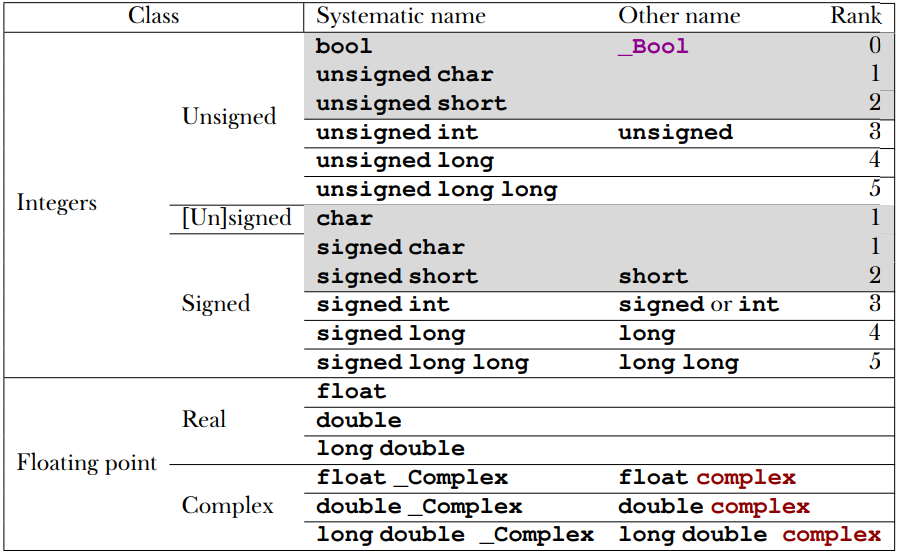
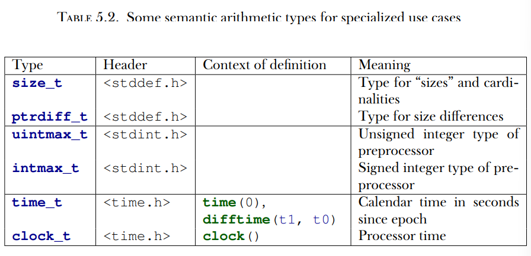
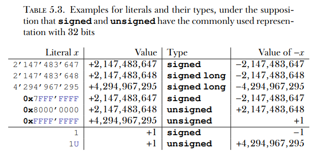
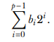
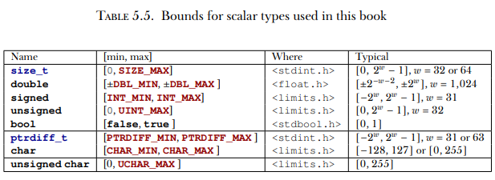
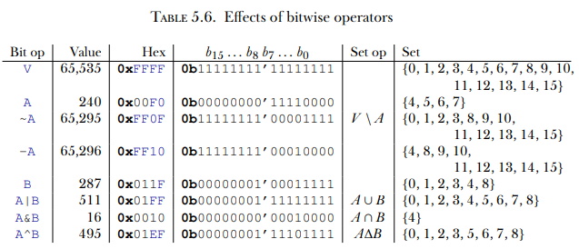
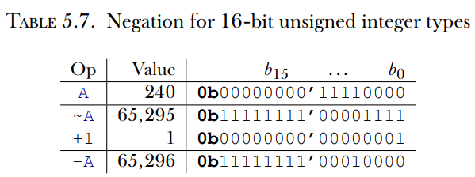
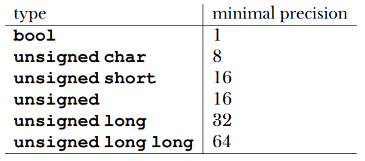
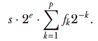
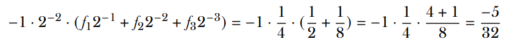

# **Capítulo 5 - Valores básicos e dados**

Esta seção abrange:
* Entendendo a máquina de estados abstratos
* Trabalhar com tipos e valores
* Inicialização de variáveis
* Utilização de constantes nomeadas
* Representações binárias de tipos

Agora mudaremos o foco de "como as coisas devem ser feitas" (declarações e expressões) para as coisas nas quais programas em C operam: valores e dados. Um programa concreto em uma instância no tempo tem que *representar* valores. Humanos possuem uma estratégia similar: hoje em dia, usamos uma representação decimal para escrever números em papel usando o sistema numérico Hindu-Arábico. Mas temos outros sistemas para escrever números: por exemplo, numerais romanos (I, II, III, IV ...) ou notação textual. Para saber que a palavra *doze* denota o valor 12 é um passo não-trivial e nos lembra que linguagens Europeias denotam números não apenas em decimais mas também em outros sistemas. Inglês e Alemão misturam com base 12, Francês com bases 16 e 20. Para falantes de Francês não-nativos, pode ser difícil de, espontaneamente, associar *quatre vingt quinze* (quatro vezes vinte e quinze) com o valor 95.

De maneira similar, representações de valores em um computador podem variar "culturalmente" de uma arquitetura para outra ou são determinados pelo tipo que o programador dá ao valor. Portanto, deveríamos tentar raciocinar primáriamente sobre valores e não sobre representações se quisermos escrever código portável.

Se você já tem alguma experiência em C e em manipulação de bytes e bits, precisará fazer um esforço para "esquecer" ativamente seu conhecimento para a maioria desta seção. Pensar sobre representações concretas de valores em seu computador irá dificultar (inhibit) mais do que ajudar.

A representação que um valor particular tem deveria, na maioria dos casos, não ser sua preocupação. O compilador está ali para organizar a tradução entre valores e representações.

Nesta seção, veremos como se espera que as diferentes partes desta 
tradução funcionem. O mundo ideal no qual você normalmente "discutirá" em seu programa é a máquina de estados abstratos de C (seção 5.1). Ela dá uma visão da execução do seu programa, que é na maior parte independente da plataforma na qual o programa é executado. Os componentes do *estado* desta máquina, os *objetos*, todos tem uma interpretação fixa (seu tipo) e um valor que varia no tempo. Os tipos básicos de C são descritos na subseção 5.2, seguidos por descrições de como podemos expressar valores específicos para estes tipos básicos (seção 5.3), como tipos são agrupados em expressões (seção 5.4), como podemos garantir que nossos objetos inicialmente tem os valores desejados (seção 5.5), como podemos dar nomes aos valores recorrentes (seção 5.6) e como tais valores são representados na máquina de estados abstratos (subseção 5.7).

## 5.1 A máquina de estados abstratos
Um programa em C pode ser visto como um tipo de máquina que manipula valores: os valores particulares que variáveis do programa tem em um determinado momento e valores intermediários que são resultado de expressões computadas. Vamos considerar um exemplo básico:
```
double x = 5.0;
double y = 3.0;
...
x = (x * 1.5) - y;
printf("x is \%g\n", x);
```

Aqui temos duas variáveis, x e y, que tem valores inicias 5.0 e 3.0, respectivamente. A terceira linha compita algumas expressões: a subexpressão `x` que avalia x e fornece o valor 5.0, `(5.0 * 1.5)` que resulta no valor 7.5, `y` que avalia y e fornece o valor 3.0, `7.5 - 3.0` que resulta em 4.5; `x = 4.5` que muda o valor de x para 4.5 e `x` que avalia x novamente mas agora fornece o valor 4.5 e printf("x is \%g\n", 4.5) que exibe uma linha de texto no terminal.

Nem todas as operações e seus valores resultantes são *observáveis* de dentro de seu programa. Eles são observáveis apenas se forem armazenados em uma memória *endereçável* ou escritos para um dispositivo de saída. No exemplo, até um certo ponro, a declaração printf 'observa' o que foi feito na linha anterior avaliando a variável x e então exibindo uma representação de string daquelel valor no terminal. Mas as outras subexpressões e seus resultados (como multiplicação e subtração) não são observáveis como tal, já que nunca definimos uma variável para armazenar esses valores.

O seu compilador C tem permissão de simplificar(shortcut) qualquer dos passos durante um processo chamado *otimização* apenas se garantir a realização dos resultados finais. Aqui, em nosso exemplo de brinquedo, existem basicamente duas possibilidades. A primeira é que a variável x não é usada mais tarde no programa, e seu valor adquirido só é relevante para a nossa declaração printf. Neste caso, o único efeito da nossa seção de código é exibir para o terminal, e o compilador pode (e vai) substituir a seção inteira com o equivalente `printf("x is 4.5\n");`. Isto é, todas as computações são feitas na hora da compilação, e o executável produzido só exibirá uma string fixa. Todo o código restante e mesmo as definições das variáveis desaparecem.

A outra possibilidade é que x pode ser usado mais tarde. Então um compilador decente faria algo como:
```
double x = 4.5;
prinft("x is 4.5\n");
```
ou
```
printf("x is 4.5\n");
double x = 4.5;
```

pois, para usar x em um momento posterior, não é relevante se a atribuição ocorreu antes ou depois de printf.

Para uma otimização ser válida, só é importante que um compilador C produza um executável que reproduza os *estados observáveis*. Estados observáveis consistem nos conteúdos de algumas variáveis (e entidades similares que veremos mais tarde) e a saída pois eles evoluem durante a execução do programa. Todo este mecanismo de mudança é chamado máquina de estados abstratos.

Para explicar a máquina de estados abstratos primeiro precisamos olhar os conceitos de um *valor* (qual estados estamos), *tipo* (o que este estado representa), e a *representação* (como o estado se distingue). Como o termo *abstratos* sugere, o mecanismo de C permite que diferentes plataformas realizem a máquina de estados abstratos de um dado programa de forma diferente de acordo com suas necessidades e capacidades. Esta permissividade é uma das chaves do potencial de otimização de C.

5.1.1 *Valores*. Um valor em C é uma entidade abstrata que geralmente existe além do seu programa, a implementação particular daquele programa e a representação do valor durante uma execução em particular do programa. Como um exemplo, o valor e conceito de 0 deveria e sempre terá os mesmos efeitos em todas as plataformas de C: acrescentar este valor a outro valor x será, novamente, x, e avaliar um valor 0 em uma expressão de controle sempre acionará o desdobramento false da declaração de controle.

Até aqui, a maioria de nossos exemplos foi com algum tipo de números. Isto não é um acidente; é relacionado a um dos principais conceitos de C: *Todos os valores são números ou se traduzem para números*. Esta propriedade abrange todos os valores dos quais tratam programas em C, sejam eles caracteres ou texto que exibimos, valores verdade, medidas feitas ou relações que investigamos. Pense nesses números como entidades matemáticas que são independentes do seu programa e sua realização concreta.

Os *dados* da execução de um programa consistem em todos os valores agrupados (assembled) de todos os objetos em um dado momento. O *estado* da execução de um programa é determinado por:
* O executável
* O ponto de execução atual
* O dado
* Intervenções externas, como IO do usuário

Se abstrairmos do último ponto, um executável que executa com os mesmos dados do mesmo ponto de execução deve retornar o mesmo resultado. Mas como programas em C deveriam ser portáveis através de sistemas, queremos mais que isso. Não queremos que o resultado de uma computação dependa do executável (que é específico de cada plataforma), mas idealmente dependa apenas na própria especificação do programa. Um passo importante para atingir esta independência de plataforma é o conceito de *tipos*.

5.1.2 *Tipos*. Um tipo é uma propriedade adicional que C associa com valores. Até agora, vimos vários desses tipos, predominantemente size_t, mas também double e bool. *Todos os valores tem um tipo determinado estáticamente*. *Operações possíveis em um valor são determinadas por seu tipo*. *O tipo de um valor determina os resultados de todas as operações*.

5.1.3 *Representação binária e a máquina de estados abstratos*. Infelizmente, a grande variedade de plataformas computacionais não é uma que permite que o padrão C possa impor completamente os resultados das operações em um dado tipo. Algumas coisas não especificadas completamente pelo padrão incluem, por exemplo, a precisão na qual uma operação de ponto flutuante com tipo double seja realizada (floating-point representation). C apenas impõe propriedades em representações de modo que os resultados das operações possam ser deduzidos a priori de duas fontes diferentes:
* Os valores dos operandos
* Alguns valores característicos que descrevem a plataforma particular.

Por exemplo, operações no tipo size_t podem ser determinadas completamente ao inspecionar o valor de SIZE_WIDTH além dos operandos (Antes de C23, este valor não é disponívels. Precisa-se do valor de SIZE_MAX. Similarmente, sabendo que a representação de sinal agora é fixa ao complemento de 2, os valores mínimos e máximos podem ser deduzidos para todos os tipos inteiros). Chamamos o modelo para representar os valores de um determinado tipo em uma dada plataforma a representação binária do tipo. *A representação binário de um tipo determina os resultados de todas as operações*. *A representação binária de um tipo é observável*.

Geralmente, todas as informações necessárias para determinar este modelo estão ao alcance de qualquer programa em C. Os cabeçalhos da biblioteca C fornecem as informações necessárias através de valores nomeados (como SIZE_MAX), operadores e chamadas a funções.

Esta representação binária ainda é um modelo e, assim, uma representação abstrata no sentido que não determina completamente como valores são armazenados na memória de um compitador ou em um disco ou outro dispositivo de armazenamento persistente. Esta representação é a *representação de objeto*. Diferente da representação binária, a representação de objeto não costuma ser de preocupação para nós desde que não queiramos juntar valores de objetos na memória principal ou ter de comunicar entre computadores que tem modelos de plataforma diferentes. Muito à frente, na seção 12.1, veremos que podemos até observar a representação de objetos, *se* tal objeto está guardado na memória *e* conhecermos seu endereço.

Como consequência, toda a computação é fixa através de valores, tipos e suas representações binárias que são especificadas no programa. O texto do programa descreve uma máquina de estados abstratos que regula como o programa troca de um estado para o próximo. Estas transições são determinadas pelo valor, tipo e representação binária apenas. *Programas executam como se estivessem seguindo a máquina de estados abstratos*.

5.1.4 *Otimização*. Como um executável concreto consegue seguir a descrição da máquina de estados abstratos é deixado à discrição dos criadores de compiladores. A maioria dos compiladores de C modernos produzem código que *não* segue a prescrição exata do código: eles "simplificam" (cheat) sempre que podem e apenas respeitam os estados observáveis da máquina de estados abstratos. Por exemplo, uma sequência de somas com valores constantes como

```
x += 5;
/* Faz alguma outra coisa com x */
x += 7;
```

Pode, em muitos casos, ser feito como se tivéssemos especificado ou

```
/* Faz alguma coisa sem x. */
x += 12;
```

ou

```
x += 12;
/* Faz alguma coisa sem x. */
```

O compilados pode realizar essas alterações na ordem de execução desde que não haja diferença observável no resultado: por exemplo, desde que não exibamos o valor intermediário de x e desde que esses valores intermediários não sejam usados em outra computação.

Mas esse tipo de otimização também pode ser proibida pois o compilador não pode provar que uma certa operação não forçará o término do programa. Em nosso exemplo, muita coisa depende do tipo de x. Se o valor atual de x poderia estar perto do limite superior do tipo, a aparentemente inocente operação x += 7 poderia gerar um transbordamento (overflow). Tais transbordamentos são resolvidos diferentemente de acordo com o tipo. Como vimos, transbordamento de um tipo sem sinal não é um problema, e o resultado da operação condensada sempre será consistente com as duas separadas. Para outros tipos, como tipos inteiros com sinal (signed) e tipos de ponto flutuante (double, racionais), um transbordamento pode levantar (raise) uma exceção e finalizar o programa. Neste caso, a otimização não pode ser feita.

Como já foi comentado, esta folga permitida entre a descrição do programa e a máquina de estados abstratos é um recurso bastante útil, normalmente chamado otimização. Combinado com a simplicidade relativa da descrição de sua linguagem, isto é, de fato, um dos principais recursos que permite que C tenha melhor desempenho que outras linguagens de programação. Uma consequência importante desta discussão pode ser sumarizada em: *O tipo determina as oportunidades de otimização*.

## 5.2 Tipos básicos

C tem uma série de tipos básicos e maneiras de construir *tipos derivados* deles que será descrito no capítulo 6. Principalmente por questões históricas, o sistema de tipos básicos é um pouco complicado, e a sintaxe para especificar estes tipos não é direta. Existe um primeiro nível de especificação que é feita inteiramente com palavras chave da linguagem, como signed, int e double. O primeiro nível é, principalmente, organizado de acordo com questões internas de C. Em cima dele, há um segundo nível de especificação que vem através de arquivos de cabeçalho (header files) e já vimos exemplos: size_t e bool. Este segundo nível é organizado por semânticas de tipo, especificando quais propriedades um tipo particular disponibiliza ao programador. 

Iniciaremos com a especificação de primeiro-nível desses tipos. Todos os valores básicos em C são números, mas existem diferentes tipos de números. Como uma distinção principal, temos duas classes diferentes de números, cada uma com duas subclasses: unsigned integers (inteiros sem sinal), signed integers (inteiros com sinal), real floating-point numbers (números reais de ponto flutuante) e complex floating-point numbers (números complexos de ponto flutuante). Cada uma dessas 4 classes contém vários tipos. Eles diferem de acordo com sua precisão, que determina a faixa de valores válidos para cada tipo particular. A tabela 5.1 tem uma visão geral dos 18 tipos básicos. Os tipos com um fundo cinza não permitem aritmética, sendo promovidos antes da realização da aritmética.



Como pode-se ver da tabela, existem seis tipos que não podemos usar diretamente para aritmética, os *tipos estritos* (narrow types). Eles são *promovidos* para um dos tipos mais largos antes de serem considerados em uma expressão aritmética. Atualmente, em qualquer plataforma realista, esta promoção será um signed int do mesmo valor que o tipo estrito, independente de se o tipo estreito tinha sinal ou não.

Observe que, entre os tipos inteiros estreitos, temos dois membros proeminentes: char e bool. O primeiro é o tipo em C qeu lida com caracteres exibíveis para texto, e o segundo guarda valores de verdade, false e true. Como dito anteriormente, para C, mesmo eles são apenas algum tipo de número. Os outros 12 não-promovidos (unpromoted) se dividem nas quatro classes comentadas acima.

Diferente do que muitos acreditam, o padrão C não prescreve a precisão desses 12 tipos: apenas restringe-os. Eles dependem em muitos fatores que são definidos na implementação. Uma das coisas que o padrão prescreve é que a faixa de valores possíveis para os tipos com sinal deve incluir uma a outra de acordo com seu rank, ou seja, (((((char)short)int)long)long long). Mas essa inclusão não precisa ser estrita. Por exemplo, em muitas plataformas, o conjunto de valores de int e long são o mesmo, apesar dos tipos serem considerados diferentes. Uma inclusão análoga também se mantém para os seis tipos sem sinal: ((((((bool)unsigned char)unsigned short)unsigned int)unsigned long)unsigned long long). Mas lembre-se que para qualquer aritmética ou comparação, os tipos sem sinal estreitos são promovidos para signed int e não unsigned int. 

A comparação das faixas dos tipos com e sem sinal é mais difícil. Obviamente, um tipo sem sinal jamais incluirá os valores negativos de um tipo com sinal. Para os valore não-negativos, temos a seguinte inclusão de valores dos tipos com rank correspondente: ((Valores com sinal não negativos)Valores sem sinal). Isto é, para um determinado rank, os valores não negativos do tipo com sinal cabem dentro do tipo sem sinal. Em qualquer plataforma moderna, esta inclusão é estrita: o tipo sem sinal tem valores que não cabem no tipo com sinal. Por exemplo, um par comum de valores máximos é 2^31 - 1 = 2,147,483,647 para signed int e 2^32 - 1 = 4,294,967,295 para unsigned int. Como a interrelação entre os tipos inteiros depende da plataforma, a escolha do "melhor" tipo para um determinado propósito de uma maneira portável pode ser uma tarefa entediante. Por sorte, temos alguma ajuda da implementação do compilador, que nos fornece com typedefs como size_t que representa certas características. *Use size_t para tamanhos, cardinalidades ou números ordinais*.

Lembre-se que tipos sem sinal são os mais convenientes pois são o únco tipo que tem aritmética definida consistentemente com propriedades mateméticas: a operação módulo. Eles não podem criar sinais no transbordamento e tem melhor otimização. Eles serão descritos em mais detalhes na subseção 5.7.1.  *Use unsigned para quantidades pequenas que não podem ser negativas*.

*Use signed para quantidades pequenas que possuem sinal*.

*Use ptrdiff_tpara diferenças grandes que possuem sinal*.

*Use double para cálculos fracionais*.

*Use double complex para cálculos de números complexos*.

O padrão de C define muitos outros tipos, entre eles outros tipos aritméticos que modelam casos de uso especiais. A Tabela 5.2 lista alguns deles. O segundo par representa o tipo no qual o preprocessador faz quaisquer de suas aritméticas ou comparações. Antes de C23, estes eram os tipos de tamanho máximo que o compilador suportava, mas essa restrição foi aliviada; sob certas circunstâncias, podem haver *tipos inteiros extendidos* que são maiores.



Os dois tipos clock_t e time_t são usados para trabalhar com tempos. São tipos semânticos pois a precisão da computação de tempos pode ser diferentes entre plataformas diferentes. A forma de ter um tempo em segundos que pode ser usado em aritmética é a função difftime: ela computa a diferença de duas estampas temporais. Valores clock_t apresentam o modelo da plataforma de ciclos de relógio do processador, de modo que a unidade de tempo é normalmente muito menor que o segundo; CLOCKS_PER_SEC pode ser usado para converter esses valores para segundos.

## 5.3 Especificando valores

Já vimos várias formas nas quais constantes numéricas (*literais*) podem ser especificadas:

* 123       Literal decimal inteiro
* 077       Literal octal inteiro - Especificado por uma sequência de dígitos, o primeiro sendo 0 e os restantes entre 0 e 7. Por exemplo, 077 tem o valor 63. Este tipo de especificação tem valor meramente historico e é raramente usado hoje em dia.
* 0xFFFF    Literal hexadecimal inteiro - Especificado iniciando com 0x seguido por uma sequência de dígitos entre 0...9 e a...f. Por exemplo, 0xbeaf tem o valor 48815.
* Literal binário inteiro - Especificado iniciando com 0b seguido por uma sequência de dígitos 0 ou 1. Por exemplo, 0b1010 tem o valor 10. Foram introduzidos com C23.
* 1.7E-13   Literais decimais de ponto flutuante - Estes literais são bem familiares como a versão com um ponto decimal. Também existe a notação científica com um expoente. Em geral, a forma mEe é interpretada como m * 10 ^e.
* 0x1.7aP-13    Literais hexadecimais de ponto flutuante - São normalmente usados para descrever valores de ponto flutuante de uma forma que facilita a especificação de valores que tem representações exatas. A forma geral 0xhPe é interpretada como h * 2^e. Aqui, h é especificado como uma fração hexadecimal. O expoente e ainda é especificado como um número decimal.
* 'a'       Literal de caractere integral - Estes são caracteres colocados entre apóstrofes ', como 'a' ou '?'. Eles tem valores que são fixos apenas implicitamente pelo padrão C. Por exemplo, 'a' corresponte ao código inteiro para o caractere a do alfabeto latino. Entre literais de caracteres, o caractere \ tem significado especial. Por exemplo, já vimos '\\n' para o caractere de nova linha.
* "hello"   Literais de string - Especificam texto, como os necessários para as funções printf e puts. De novo, o caracter \ é especial, assim como literais de caracteres.

Todos os literais exceto o último são constantes numéricas: especificam números. Literais de string são uma exceção e podem ser usados para especificar texto que é conhecido no momento da compilação. Integrar textos maiores em nosso código poderia ser tedioso se não pudéssemos dividir literais de string em blocos:

```
puts("first line\n"
     "another line\n"
     "first and"
     second part of the third line");
```

Ou seja, literais de string consecutivos são concatenados. 

Literais numéricos nunca são negativos. Isto é, se escrevemos algo como -34 ou -1.5e-23, o sinal não é considerado parte do número mas é o operador *negação* aplicado ao número que vem depois dele. Apesar de parecer esrtanho, o sinal negativo do expoente é considerado parte de um literal de ponto flutuante.

*Literais inteiros decimais tem sinal*. Para determinar o tipo exato para literais inteiros, sempre temos uma regra do *primeiro ajuste* (first fit): *Um literal decimal inteiro tem o primeiro dos três tipos com sinal que lhe cabem*. Esta regra pode ter efeitos surpreendentes. Suponha que em uma plataforma, o valor com sinal mínimo é -2^15 = -32 768 e o valor máximo 2^15 - 1 = 32 767. O literal 32 768, então, não cabe no tipo signed e é, assim, signed long. Como consequência, a expressão -32 768 tem tipo signed long. Assim, o valor mínimo do tipo signed nesta plataforma não pode ser escrito como um literal.

*O mesmo valor pode ter tipos diferentes*. Deduzir o tipo de um literal binário, octal ou hexadecimal é um pouco mais complicado. Eles também podem ser de um tipo sem sinal se o valor não couber em um tipo com sinal. No exemplo anterior, o literal hexadecimal 0x7FFF tem o valor 32 767 e, portanto, é do tipo signed. Além do literal decimal, o literal 0x8000 (valor 32 768 escrito em hexadecimal) então é unsigned, e a expressão -0x8000 novamente é unsigned.

*Não use literais binário, octal ou hexadecimais para valores negativos*. Como consequência, há apenas uma escolha para valores negativos: literais decimais.

Um erro comum é tentar atribuir um literal hexadecimal a um tipo signed experando que represente um valor negativo. Considere uma declaração como int x = 0xFFFF FFFF. ISto é feito sob a assunção que o valor hexadecimal tem a mesma representação binária que o valor com sinal -1. Na maioria das arquiteturas com 32-bit signed, isto será verdade (mas não todas). Entretanto, então nada garante que o valor efetivo +4 294 967 295 seja convertido para o valor -1. A tabela 5.3 tem alguns exemplos de literais interessantes, seus valores e tipos.



Então um possível prefixo (0, 0b ou 0x) não apenas especifica a base na qual um literal inteiro é lido, mas indiretamente também pode influenciar o tipo deduzido. Este tipo deduzido pode ser alterado por um sufixo que é acrescentado ao literal. Por exemplo, 1U tem valor 1 e é do tipo unsigned, 1L é signed long, e 1ULL tem o mesmo valor 1 mas o tipo unsigned long long.

Assim como sufixos, literais inteiros podem ser forçados a ter um tipo com um rank mínimo. Para um literal decimal inteiro, se há apenas um l ou L, o tipo é long se o valor cabe e long long se não. Se tem dois (ll ou LL), o tipo é fixo em long long. Para literais inteiros prefixados (0, 0b ou 0x), estes sufixos ainda podem ser unsigned long ou unsigned long long, dependendo do valor. Para forçar um tipo sem sinal, podemos acrescentar u ou U ao sufixo.

O sufixo wb ou WB que foi introduzido com C23 força o litera a ter um tipo específico com precisão de bit. Com uma combinação possível de u ou U, é o único sufixo que podem garantir um tipo de uma sinal específico (? signedness) da base. Veremos esses tipos mais tarde na seção 5.7.7.

*Literais diferentes podem ter o mesmo valor*

*O valor efetivo de um decimal de ponto-flutuante pode diferir de seu valor literal*. Por exemplo, o literal 0.2 pode ter o valor 0.200 000 000 000 000 000 011 1. Como consequência, os literais 0,2 e 0.200 ... 011 1 tem o mesmo valor. 

Literais hexadecimais de ponto-flutuante foram projetados para corresponder melhor com as representações binárias de valores de ponto flutuante. De fato, na maioria das arquiteturas modernas, tais literais (que não tem dígitos demais) corresponderão exatamente ao valor literalo. Infelizmente, são quase ilegíveis para humanos. Por exemplo, considere os dois literais:

0x1.999 9AP-3 e 0xC.CCCC CCCC CCCC CCDP-6.

Eles correspondem a

1.600 000 023 84 * 2^-3 e 12.800 000 000 000 000 000 2 * 2^-6;

assim, expressos como decimais de ponto flutuante, seus valores são aproximadamente

0.200 000 002 98 e 0.200 000 000 000 000 000 003.

Então os dois literais tem valores muito próximos entre si, enquanto sua representação como literais hexadecimais de ponto flutuante parecem colocá-los muito distante.

Por fim, literais de ponto flutuante podem ser seguidos pela letra f ou F para denotar um float ou por l ou L para denotar um long double. De outro modo, eles serão do tipo double.

5.3.1 Constantes complexas

Tipos complexos não são necessariamente suportados por todas as plataformas C. Este fato pode ser conferido inspecionando __STDC_NO_COMPLEX__. Para ter suporte completo de tipos complexos, o cabeçalho <complex.h> deveria ser incluído. Se usar <tgmath.h> para funções numéricas, isto é feito implicitamente.

C não possui literais de tipo complexo. Existem apenas diversas macros que podem facilitar a manipulação destes tipos.

A primeira possibilidade para especificar valores ocmplexos é a macro CMPLX, que engloba dois valores de ponto-flutuante, as partes real e imaginária, em um valor complexo. Por exemplo, CMPLX(0.5, 0.5) é um valor double complex com as partes real e imaginárias de 0.5. Análogamente, existem um CMPLXF para float complex e CMPLXL para long double complex.

Outra possibilidade mais conveniente é fornecida pela maxcro I, que representa um valor constante do tipo float complex de modo que I * I tem o valor -1. Nomes de macro de 1 caractere em letra maiúscula são bastante usados em programas para números que são fixos para o programa inteiro. Por si só, não é uma ideia brilhante (o número de nomes com 1 caractere é limitado), e é melhor deixar I de lado.

I pode ser usado para especificar constantes de tipos complexos similares à notação matemática usual. Por exemplo, 0.5 + 0.5I seria do tipo double complex e 0.5F + 0.5FI do tipo float complex. O compilador converte implicitamente o resultado para os tipos maiores se misturarmos, por exemplo, float e double para as partes reais e imaginárias. Outra forma de codificar constantes complexas é usando literais complexos. Eles são literais de ponto flutuante com um i extra, por exemplo, 0.5i ou 0.5IF.

## 5.4 Conversões implícitas

Como vimos nos exemplos, o tipo de um operando tem influência sobre o tipo de uma expressão de operador, como -1 ou -1U. Enquanto o primeiro é um signed int, o segundo é um unsigned int. Como unsigned não possui valores negativos, -1U é, na verdade, um número positivo grande. *- e = unários tem o tipo do seu operando promovido*.

Assim, esses operadores são exemplos onde o tipo, geralmente, não muda. Em casos onde eles mudam, dependemos da estratégia de C para realizar *conversões implícitas*: isto é, alterar um valor com um tipo específiico para um com o tipo desejado. Considere os seguintes exemplos, novamente assumindo que -2 147 483 648 e 2 147 483 647 são os valores mínimo e máximo de um signed int, respectivamente:

```
double         a = 1;              // Inofensivo; o valor cabe no tipo
signed short   b = -1;             // Inofensivo; o valor cabe no tipo
signed int     c = 0x8000'0000;    // Perigoso; valor muito grande para o tipo
signed int     d = -0x8000'0000;   // Perigoso; valor muito grande para o tipo
signed int     e = -2'147'483'648; // Inofensivo; o valor cabe no tipo
unsigned short g = 0x8000'0000;    // Perde informação; tem valor 0
```

Aqui, as inicializações de `a` e `b` são inofensivas pois seus valores cabem no tipo desejado, com o compilador C convertendo-os silenciosamente.

As próximas duas conversões para `c` e `d` são problemáticas. Como vimos, 0x8000'0000 é do tipo unsigned int e não cabe em um signed int. Assim, `c` recebe um valor que é definido-por-implementação, e temos que saber o que nossa plataforma faz nesses casos. Poderia apenas reutilizar o padrão de bits  do valor à direita ou encerrar o programa. 

Para o caso de `d`, a situação é ainda pior. 0x8000'0000 tem o valor 2 147 483 648, e poderíamos esperar que `-d` fosse só o valor negativo. Mas como -0x800'0000 é 2 147 483 648, o mesmo problema ocorre que foi visto para `c`.

Então, `e` também é inofensivo pois usamos -2 147 483 648 como um literal decimal negado de tipo signed long, cujo valor efetivo é o informado. Como este valor cabe em signed int (é o valor mínimo), a caonversão pode ser feita sem problema.

O último exemplo de `g` tem consequências ambíguas. Um valor que é muito grande para um tipo sem sinal é convertido de acordo com o módulo. Neste caso em particular, se assumimos que o valor máximo de unsigned short é 2^16 -1, o valor resultante é 0. É difícil dizer se esta conversão "estreitadora"  é o resultado desejado. *Evite conversões estreitadoras (narrowing)*. *Não use tipos estreitos em aritmética*.

As regras dos tipos tornam-se ainda mais complicadas para operadores que tem dois operandos, como adição e multiplicação, pois eles, então, podem ter tipos diferentes. Alguns exemplos:

```
1         + 0.0     // Inofensivo; double
1         + I       // Inofensivo; complex float
INT_MAX   + 0..0F   // Pode perder precisão; float
INT_MAX   + I       // Pode perder precisão; complex float
INT_MAX   + 0.0     // Geralmente inofensivo; double
```

Neste caso, os dois primeiros exemplos são inofensivos: o valor o literal inteiro 1 cabe no tipo double ou complex float. De fato, na maioria desse tipo de operações miscigenadas, sempre que o alcance de um tipo cabe no alcance de outro, o resultado tem o tipo de maior alcance.

Os próximos dois são problemáticos pois INT_MAX, o valor máximo de um signed int, normalmente não cabe em um float nem complex float. A última linha mostra que para uma operação com double, isto funcionaria na maioria das plataformas.

Como não existe uma inclusão restrita de faixas de valores para tipos inteiros, deduzir o tamanho de uma operação que mistura valores com e sem sinal pode ser chato:

```
-1 < 0         // Verdadeiro, inofensivo, mesmo sinal
-1L < 0        // Verdadeiro, inofensivo, mesmo sinal
-1U < 0U       // Falso, inofensivo, mesmo sinal
-1 < 0U        // Falso, perigoso, sinal misturado
-1U < 0        // Falso, perigoso, sinal misturado
-1L < 0U       // Depende, perigoso, mesmo sinal ou misturado
-1LL < 0UL     // Depende, perigoso, mesmo sinal ou misturado
```

As primeiras três comparações são inofensivas pois mesmo que misturem operandos de tipos diferentes, não misturam a propriedade do sinal. Para estes casos, como as faixas de valores possíveis contém uma a outra, C somente converte o outro tipo para o maior e realiza a comparação nele.

Os próximos dois casos não são ambíguos mas, talvez, não o que um programador inexperiente(naive) esperaria. De fato, para ambos, todos os operandos são convertidos para unsigned int. Assim, Ambos valores negados são convertidos para valores sem sinal grandes, e o resultado da comparação é falso.

As últimas duas comparações são ainda mais problemáticas. Em plataformas onde INT_WIDTH < LONG_WIDTH, 0U é convertido para 0L, e, assim, o primeiro resultado é true. Em plataformas onde INT_WIDTH == LONG_WIDTH, -1L é convertido para -1U (Isto é, UINT_MAX), e, assim, a primeira comparação é false. Observações análogas se mantém para a segunda comparação dessas duas, mas o resultado das duas pode não ser o mesmo.

*Evite operações com operandos de diferente sinal (signedness/ tipo signed e unsigned)*. *Use tipos sem sinal sempre que possível*. *Escolha seus tipos aritméticos de modo que conversões implícitas são inofensivas*.

## 5.5 Inicializadores

Já vimos (na seção 2.3) que o inicializador é uma parte importante na definição de um objeto. Inicializadores ajudam-nos a garantir que a execução de um programa sempre esteja em um estado definido de modo que sempre que acessamos um objeto, tenha um valor bem-conhecido que determina o estado da máquina abstrata. *Todas as variáveis deveriam ser inicializadas*.

A única exceção a esta regra deve ser feita para código que deve ser altamente otimizado. Para a maioria do código que fomos capazes de escrever até aqui, um compilador moderno será capaz de traçar a origem de um valor a sua última atribuição ou inicialização. Inicializações ou atribuições supérfluas serão simplesmente retiradas durante otimização.

Para tipos escalares como inteiros e pontos flutuantes, um inicializador apenas contém uma expressão que pode ser convertida para aquele tipo. Vimos muitos exemplo disto. Opcionalmente, expressões de inicialização podem estar cercadas por {}. Alguns exemplos:

```
double a = 7.8;
double b = 2 * a;
double c = { 7.8 };
double d = { 0 };
```

Iijcializadores ára outros tipos **devem** ter as chaves {}. Por exemplo, inicializadores de matrizes contém inicializadores para os diferentes elementos, cada qual seguido de uma vírgula:

```
double A[] = { 7.8, };
double B[3] = { 2 * A[0], 7, 33, };
double C[] = { [0] = 6, [3] = 1,};
```

(A[0] = double 7.8)//(B[0] = double 15.6; B[1] = double 7.0; B[2] = double 33.0)//(C[0] = double 6.0; C[1] = double 0.0; C[2] = double 0.0; C[3] = double 1.0)

Como vimos, se não existe a especificação do tamanho, a matriz é dita como tendo um tipo incompleto. O tipo é, então, completo pelo inicializador para especificar completamente o tamanho. Aqui, A tem apenas um elemento, enquanto C tem 4. Para os dois primeiros inicializadores, o elemento ao qual a inicialização escalar aplica-se é deduzido da posição do escalar na lista: por exemplo, B[1] é inicializado com o valor 7. A forma de C é chamada inicializadores designados. Eles são, de longe, preferíveis pois tornam o código mais robusto contra pequenas alterações nas declarações. *Use inicializadores designados para todos os tipos de dados agregados*.

Se não souber como inicializar um variável do tipo T, o inicializador padrão sempre funcionará:

```
T a = { };
```

Este recurso foi introduzido apenas em C23; antes disso, tínha-se que usar { 0 }, e havia um raciocínio relativamente complicado que fazia isso funcionar. Este inicializador padrão também pode ser usado para matrizes de tamanho variável (seção 6.1.3), que anteriormente não tinham uma sintaxe de inicialização. Em inicializadores, frequentemente temos que especificar valores que tem um significado particular para o programa.

## 5.6 Constantes nomeadas

Um problema comum, mesmo em programas pequenos, é que eles usam valores especiais para alguns propósitos que são textualmente repetidos por todo o programa. Se, por alguma razão este valor sofre alteração, o programa quebra. Considere um cenário artificial onde temos matrizes de strings (este tipo usa um pointer do tipo char const * const, que veremos mais tarde), nas quais gostaríamos de realizar algumas operações:

```
char const*const bird[3] = {
     "raven",
     "magpie",
     "jay",
};
char const*const pronoun[3] = {
     "we",
     "you",
     "they",
};
char const*const ordinal[3] = {
     "first",
     "second",
     "third",
};
...
for (unsigned i = 0; i < 3; ++i)
     printf("Corvid %u is the %s\n", i, bird[i]);
...
for (unsigned i = 0; i < 3; ++i)
     printf("%s plural pronoum is %s\n, ordinal[i], pronoun[i]);
```

Aqui usamos a constante 3 em vários locais com três "significados" diferentes que não tem muita relação. Por exemplo, uma adição ao grupo de corvids precisaria de duas alterações separadas do código. Em um cenário real, poderiam haver muito mais lugares no código que dependeriam deste valor em particular, e em um base de código grande, isto pode ser muito tedioso de se manter. *Todas as constantes com um significado particular devem ser nomeadas*. *Todas as constantes com sisgnificados diferentes devem ser distinguidas*.

No início, C tinha surpreendentemente poucas maneiras de especificar constantes nomeadas, e sua terminologia até causava muita confusão sobre quais construtos levavam, efetivamente, a constantes na hora da compilação. Portanto, primeiros precisamos estabelecer a terminologia (seção 5.6.1) antes de olhar nas constantes nomeadas apropriadamente que C forneceu até C23: constantes de enumeração (seção 5.6.2). A última nos ajudará a substituir as diferentes versões de 3 no nosso exemplo com algo mais explicativo. Um segundo mecanismo, genérico, complementa este recurso com substituição de texto simples: macros (subseção 5.6.3). Macros só levam a constantes da hora da compilação se suas substituições forem compostas de literais de tipos básicos, como vimos. Por fim, distinguimos um conceito de objetos temporários sem-nome chamado de literais compostos (seção 5.6.4) e C23 novos objetos consexpt que também servem como constantes nomeadas ou não (seção 5.6.5).

5.6.1 Objetos somente-leitura

Não confunda o termo *constante*, que tem um significado muito específico em C, com objetos que não podem ser modificados. Por exemplo, no código anterior, bird, pronoun e ordinal não são constantes de acordo com nossa terminologia; são objetos 'const-qualified'. Este *qualificador* especifica que não temos o direito de alterar este objeto. Para bird, nem as entradas da metriz nem as próprias strings podem ser alteradas, e seu compilador deveria dar um diagnóstico se tentar fazê-lo: *Um objeto do tipo const-qualified é somente-leitura*.

Isto não significa que o compilador ou o sistema de execução não possam, talvez, alterar o valor de tais objetos: outras partes do programa podem ver aquele objeto sem a qualificação e alterá-lo. O fato que você não pode escrever o sumário de sua conta bancária diretamente (mas apenas lê-lo) não significa que permanecerá constante no tempo.

Existe outra família de objetos somente-leitura que, infelizmente, não são protegidos da modificação de seu tipo: literais de string. *Literais de string são somente leitura*.

Se introduzidos hoje, o tipo de literais de string certamente seria char const[], uma matriz de caracteres const-qualified. Infelizmente, a palavra-chave const foi introduzida em C muito mais tarde que literais de string, e, portanto, permaneceu como é para compatibilidade retroativa.

Matrizes como bird também usam outra técnica para lidar com literais de string. Elas usam um tipo *pointer*, char const*const, para referir-se a um literal de string. Isto é, os próprios literais de string não são armazenados na matriz bird, mas em algum outro lugar, e bird apenas referencia esses lugares. Veremos mais tarde, nas seções 6.2 e 6.11, como este mecanismo funciona.

Desde C23, existe outro construto indicado pela palavra chave constexpr, que resulta em objetos somente-leitura. Mas, em contraste com objetos que são simplesmente const-qualified, eles garantem que nunca serão alterados, e seu valor é conhecido na hora da compilação. A diferença pode ser vista no seguinte exemplo:

```
extern double const factor;
constexpr double pi = 3.141'592'653'589'793'238'46;
```

A declaração de factor apenas nos diz (e ao compilador) que, em algum lugar, existe um objeto double que não temos o direito de alterar. Quando e onde este valor é determinado não é especificado. Por outro lado, o valor de pi é dado junto com a declaração e permanecerá estável por toda a compilação do programa. Veremos constexpr em mais detalhe mais tarde.

5.6.2 Enumerações

C tem um mecanismo simples de nomear pequenos inteiros como precisamos de deles no exemplo, chamado enumerações (enumerations):
```
enum corvid { magpie, raven, jay, corvid_num, };
char const*const bird[corvid_num] = {
     [raven] = "raven",
     [magpie] = "magpie",
     [jay] = "jay",
};
...
for (unsigned i=0; i < corvid_num; ++i>)
     printf("Corvid %u is the %s\n", i, bird[i]);
```

Isto declara um novo tipo inteiro enum corvid para o qual sabemos quatro valores diferentes. Como pode ter adivinhado, valores posicionais iniciam do 0 e vão para a frente, entao em nosso exemplo temos ravem com valor 0, magpie com 1, jay com 2 e corvid_num com 3. *Enumerações tem ou valor ou explícito ou posicional.*

Note que isto usa uma ordem diferente para as entradas da matriz que antes, o que é uma das vantagens da abordagem com enumerações: não temos que, manualmente, rastrear a ordem usada na matriz. O ordenamento que é fixo no tipo enumeração faz isso automaticamente.

Agora, se quisermos acrescentar outro corvid, colocamos-o na lista, em qualquer lugar antes de corvid_num.

Como para a maioria dos outros tipos estritos, não existe muito interesse em declarar variáveis de um tipo enumeração como dado aqui; para indexação e aritmética, eles seriam convertidos para signed ou unsigned de qualquer forma. Mesmo as constantes de enumeração em si não são, necessariamente, do tipo enumeração. *Se todas as constantes de enumeração de um tipo enumeração simples cabem em signed int, elas terão esse tipo*.

Assim, para valores pequenos, o interesse está, na verdade, nas constantes, não no tipo recentemente criado. Podemos, portanto, nomear qualquer signed int constante que precisarmos, sem mesmo fornecer uma tag para o nome do tipo:
```
enum { p0 = 1, p1 = 2*p0, p2 = 2*p1, p3 = 2*p2, };
```

Para definir essas constantes, podemos usar expressões inteiras constantes (Integer Constant Expressions, ICE). Tal ICE fornece um valor inteiro na hora da compilação e é muito restrito. Não apenas seu valor deve ser determinável na hora da compilação (chamadas a funções não são permitidas), mas também nenhuma avaliação de um objeto deve participar como um operando para o valor:

```
signed const        o42 = 42;
constexpr signed    c42 = 42;
enum {
     b42 = 42,           // OK: 42 é um literal.
     c52 = o52 + 10,     // Erro: o42 é um objeto.
     b52 = b42 + 10,     // OK: b42 não é um objeto.
     d52 = c42 + 10,     // OK: C42 é uma constante nomeada.
};
```

Aqui, o42 é um objeto, apesar de ser const-qualified, então a expressão para c52 não é uma expressão inteira constante. Com c42, podemos ver que constexpr pode ser usado livremente neste contexto. *Uma expressão inteira constante pode apenas avaliar objetos que são declarados com constexpr*.

Então, principalmente, um ICE pode consistir de quaisquer operações com literais inteiros, constantes de enumeração, objetos constexpr, e subexpressões alignof(desde C23, antes _Alignof) e offsetof, e, eventualmente, algumas subexpressões sizeof.

Antes de C23, mesmo que o valor fosse um ICE, para poder utilizá-lo para definir uma constante de enumeração, tínhamos que garantir que o valor coubesse em um signed int. Isto mudou com C23. *Se constantes de enumeração não cabem em signed int, se possível, o tipo enumeração é ajustado de modo que possa armazenar todas as constantes de enumeração.* *Se as constantes de enumeração não cabem em signed int, as constantes tem o tipo enumeração*.

Perceba que pode, de fato, ocorrer que não haja um tipo que consiga armazenar todos os valores para as constantes:

```
enum tooLarge { minimus = LLONG_MIN, maximus = ULLONG_MAX, };
```

A menos que o compilador encontre um tipo inteiro extendido que seja maior que signed long long, esta linha, provavelmente, não compilará. O fato que tipos enumeração são ajustados pode ser convenienete quando não estamos interessados no tipo:
```
enum wide {minal = LONG_MIN, maximal = LONG_MAX, };
typedef enum wide wide;
```

Aqui, depende da plataforma se long é maior que signed, de modo que o tipo subjacente (underlying) de wide pode ser qualquer um deles, dependendo das circusntâncias. C23 também trouxe nova sintaxe para forçar o tipo subjacente a ser um específico:

```
enum wider : long { minimer = LONG_MIN, maximer = LONG_MAX, };
typedef enum wider wider;
```

Dois pontos seguidos por um tipo inteiro indica o tipo subjacente e força que as constantes de enumeração tenham o tipo de enumeração, mesmo se os valores coubessem em signed:

```
enum narrow : unsigned char { zero, one, };
typedef enum narrow narrow;
```

A propriedade que um tipo enumeração é ajustado de modo que caibam todas as suas constantes poderia ter efeitos surpreendentes para usuários do tipo e deveriam, provavelmente, não ser abusadas. Então, é preferível especificar o tipo inteiro explicitamente, sempre que possível. *Se as constantes de enumeração potencialmente não caibam todas em signed int, especifique o tipo inteiro de um tipo enumeração*.

Isto é bem importante se o tipo subjacente poderia ser com ou sem sinal, como no seguinte:

```
enum large { down = 0, up = 0xFFFF'FFFF, };  // Ambíguo, não use
typedef enum large large;
```

Aqui, dependendo do tamanho de signed int, a constante 0xFFFF'FFFF poderia ter qualquer um dos tipos signed, unsigned, signed long, unsigned long, signed long long ou unsigned long long, e, assim, o tipo inteiro subjacente poderia ser qualquer um deles. Para um leitor ocasional, seria melhor declarar claramente a intenção:

```
enum eInt : signed int { dInt = 0, uInt = 0xFFFF'FFFF, };
typedef enum eInt eInt;
enum eSig : typeof(4'294'967'295) {dSig = 0, uSig = 4'294'967'295, };
typedef enum eSig eSig;
enum e32 : uint32_t {d32 = 0, u32 = 0xFFFF'FFFF, };
typedef enum e32 e32;
```

A primeira definição para eInt só compilaria se signed int the um tamanho maior que 32. O segundo eSig usa o recurso typeof (que será apresentado com mais detalhe no capítulo 18) para declarar, explicitamente, que queremos que o tipo seja de uma das constantes decimais. Este tipo sempre será com sinal. O terceiro para e32 usa a definição de tipo uint32_t para indicar que o tipo desejado é um tipo sem sinal com tamanho de, pelo menos, 32.

5.6.3 Macros

Antes de C23, não havia outro mecanismo para declarar constantes no senso restrito da linguagem C de outros tipos além do signed int. Em vez disso, C propões outro mecanismo poderoso que introduz substituição textual do código do programa: **macros**. Uma macro é introduzida por um preprocessador `#define`:

```
# define M_PI 3.14159265358979323846
```

Esta definição de macro tem o efeito que o identificador M_PI é substituído no programa na sequência pela constante double. Tal definição de macro consiste em 5 partes diferentes:

(1) Um caractere # inicial que deve ser o primeiro caractere não-vazio na linha
(2) A palavra chave `define`
(3) Um identificador a ser declarado, nesse caso M_PI
(4) O texto de substituição, neste caso 3.14159265358979323846
(5) Um caractere de término para nova linha.

Com este truque, podemos declarar substituição textual para constantes de unsigned, size_t e double. Na verdade, o limite imposto por implementação de size_t, SIZE_MAX, é definido, assim como muitos dos outros recursos do sistema que já vimos: EXIT_SUCCESS, not_eq, complex...

No livro, tais macros padrão de C são geralmente coloridas em vermelho escuro.

A soletração desses exemplos do padrão C não é representativo para convenções que são geralmente usadas na maioria de projetos de software. A maioria deles tem regras bastante rígidas de modo que macros se destaquem visualmente do seu entorno. *Nomes de macros são todos em maiúsculo*. Só desvie dessa regra se possuir fortes motivos.

5.6.4 Literais compostos

Para tipos que não tem literais que descrevam suas constantes, as coisas são ainda mais complicadas. Para macros, temos que usar *literais compostos* no lado da substituição. Tais literais compostos tem a forma:

```
(T) {INIT}
```

Isto é, um tipo em parênteses, seguido por um inicializador. Aqui está um exemplo:

```
# define CORVID_NAME /**/          \
(char const*const[corvid_num]){    \
     [chough] = "chough",          \
     [raven] = "raven",            \
     [magpie] = "magpie",          \
     [jay] = "jay",                \
}
```

Com isso, poderíamos deixar a matriz bird de fora e reescrever nosso loop for:

```
for (unsigned i = 0; i < corvid_num; ++i)
     printf("Corvid %u is the %s\n", i, CORVID_NAME[i]);
```

Enquanto literais compostos na definição de macros podem nos ajudar a declalrar algo que se comporta de modo similar a uma constante do tipo escolhido, não é uma constante no sentido que discutimos anteriormente. *Um literal composto define um objeto*.

Em geral, esta forma de macro tem algumas armadilhas:

* Literais compostos, como mostrado até aqui, não são apropriados para ICE..
* Para nossos propósitos aqui, declarar constantes nomeadas, o tipo T deveria se const-qualified. Isto garante que o otimizador em um pouco mais de 'espaço' para gerar bom código binário para tais substituições por macros.
* *Deve* haver pelo menos um caractere de espaço entre o nome da macro e o parênteses() do literal composto, aqui indicado pelo comentário /**/. De outro modo, isso seria interpretado como o início de uma definição de uma macro tipo-função. Veremos isso muito mais tarde.
* Um caractere contrabarra no final (very end) da linha pode ser usado para continuar a definição da macro na próxima linha.
* Não deve haver ponto e vírgula no final da definição da macro. Lembre-se, isso é tudo substituição textual.

*Não esconda um ponto e vírgula de término dentro de uma macro.*

*Indente à direita marcadores de continuação para macros na mesma coluna.*

Como pode-se ver no exemplo, isso ajuda a visualizar a definição inteira da macro mais facilmente.

5.6.5 O construto constexpr

Todas essas técnicas não são muito úteis em contextos nos quais, por exemplo, precisaríamos de constantes nomeadas para tipos complicados que devem ser usados como inicializadores dentro de um arquivo. Aqui, um inicializador tem que ser uma expressão constante. C23 introduziu o construto constexpr, que pode ser aplicado para declarações e também para literais compostos. Uma declaração equivalente a nossa macro introduzia anteriormente M_PI é o seguinte:

```
constexpr double pi = 3.14159265358979323846;
```

Usando constexpr tem a vantagem de que a constante é checada na hora da compilação onde foi declarada: uma conversão que leva a uma alteração de seu valor é um erro. Por exemplo,

```
constexpr unsigned 𝜋flat = 3.141’592’653’589’793’238’46; // error
```

resulta em um erro de compilador pois dígitos significativos após o ponto decimal na direita são perdidos ao converter para o tipo unsigned na esquerda.

constexpr também pode ser usado para literais compostos:

```
# define CORVID_NAMES /**/         \
(constexpr char[8][corvid_num]){   \
[chough] = "chough",               \
[raven] = "raven",                 \
[magpie] = "magpie",               \
[jay] = "jay",                     \
}
```

Observe que mudamos para uma matriz de corvid_num matrizes de 8 caracteres cada. Cada um dessas matrizes de 8 caracteres é inicializada com valores indicados e então preenchida com zeros ao final.

Para todos esses caracteres, ao usar constexpr, o compilador sabe que não deve alterá-los durante execução, e a qualificaçao const é implicada. Este conhecimento poderia ser usado para tornar nosso programa mais eficiente, seja mais rápido (em algum sentido) ou por usar menos memória. Se a matriz, escondida por trás da macro, é indexada diretamente (como em CORVID_NAMES[raven]), a matriz inteira não é necessária. Apenas o literal string correspondente (nesse caso, "raven"), poderia ser usado diretamente pelo compilador. Ainda mais, o compilador teria permissão de usar o mesmo literal string "raven" para todas as ocorrências com índice raven, o mesmo para todos com magpie etc.

## 5.7 Representação em binário

A representação binária de um tipo é um modelo que descreve os valores possíveis para aquele tipo. Não é o mesmo que a representação de objeto na memória que descreve, mais ou menos, o armazenamento físico de valores de um determinado tipo. *O mesmo valor pode ter diferentes representações binárias*.

5.7.1 Unsigned integers

Já vimos que os tipos inteiros sem sinal são aqueles tipos aritméticos para os quais as operações aritméticas padrão tem uma descrição matemática fechada. Em termos matemáticos, eles implementam um *anel*, Z_n, o conjunto de inteiros módulo algum número N. Os valores que são representáveis são 0, ..., N-1. O valor máximo N-1 determina completamente tais tipos inteiros sem sinall e são disponíveis através de uma macro cujo nome termina com _MAX. Para os tipos inteiros sem sinal básicos, eles são UINT_MAX, ULONG_MAX e ULLONG_MAX, e são fornecidos através de <limits.h>. Como vimos, o de size_t é SIZE_MAX da biblioteca <stdint.h>.

A representação binária de valores inteiros não-negativos é sempre exatamente o que o termo indica: tais números são representados por dígitos binários b_0, b_1, ..., b_p-1, chamados **bits**.Cada um dos bits tem valor 0 ou 1. O valor de tal número é computado como 

.

O valor p na representação binária é chamado de precisão do tipo subjacente que, para tipos sem sinal, é o mesmo que a largura. Para todos os tipos sem sinal, esses valores podem ser determinados da macro correspondente, como UINT_WIDTH, ULONG_WIDTH e ULLONG_WIDTH. O bit b_0 é chamado de bit menos significativo, LSB(less-significant bit) e o bit b_p-1 é chamado de bit mais significativo, MSB(most-significant bit).

Dos bits b_i que são 1, aquele com o índice mínimo i é chamado de bit menos significativo definido (?, least-significant bit set), e o com o maior índice é chamado de bit mais significativo definido (?, most-significant bit set). Por exemplo, para um tipo sem sinal com p = 16, o valor 240 teria b_4 = 1, b_5 = 1, b_6 = 1 e b_7 = 1. Todos os outros bits são 0, o bit menos significativo definido é b_4 e o mais significativo é b_7. Vemos, da equação 1, que 2^p é o primeiro valor que não pode ser representado com o tipo. Assim, N = 2^p e a seguinte observação é verdadeira: *O valor máximo de qualquer tipo inteiro é da forma 2^p -1*.

Observe que, para esta discussão da representação de valores não-negativos, não argumentamos sobre a propriedade de sinal (signedness) do tipo. Estas regras são aplicadas igualmente para tipos com e sem sinal. O que foi dito até aqui é suficiente para descrever tais tipos sem sinal. *Aritmética em um tipo inteiro sem sinal é determinada por sua precisão*.

Por fim, a tabela 5.5 mostra os limites de alguns escalares comumente usados por todo o livro.



5.7.2 Conjuntos de bits e operações bit-a-bit

Esta representação binária simples de tipos sem sinal permite-nos usá-los para outro propósito que não está diretamente ligado à aritmética: como conjuntos de bits. Um conjunto de bits é uma interpretação diferentes de um valor sem sinal, onde assumimos que ele representa um subconjunto do conjunto base V = {0, ..., p-1} e onde pegamos o elemento i como membro do conjunto, se o bit b_i está presente.

Existem três operadores binários que operam em conjuntos de bits: |, & e ^. Eles representam a união de conjuntos A U B, interseção de conjuntos A ∩ B e a diferençpa simétrica A Δ B, respectivamente. Por exemplo, escolhemos A = 240, representando {4, 5, 6, 7} e B = 287, o conjunto de bits {0, 1, 2, 3, 4, 8}; veja a tabela 5.6. Para o resultado dessas operações, o tamanho total do conjunto base, e, portanto, a precisão p, não é necessária. Assim como para operações aritméticas, existem operadores de atribuição correspondentes &=, |= e ^=, respectivamente.



Existe, ainda, um outro operador que opera nos bits do valor: o operador complemento ~. O complemento ~A teria valor 65295 e corresponderia ao conjunto {0,1,2,3,8,9,10,11,12,13,14,15}. Este complemento de bits sempre dependerá da precisão p do tipo.

Todos esses operadores podem ser escritos com identificadores: bitor, bitand, xor, or_eq, and_eq, xor_eq e compl se você incluir o cabeçalho <iso646.h>. Uma utilização típica de conjuntos de bits é para flags, variáveis que controlam certas configurações de um programa:

```
enum corvid { magpie, raven, jay, chough, corvid_num, };
#define FLOCK_MAGPIE     1U
#define FLOCK_RAVEN      2U
#define FLOCK_JAY        4U
#define FLOCK_CHOUGH     8U
#define FLOCK_EMPTY      0U
#define FLOCK_FULL       15U

int main(void) {
     unsigned flock = FLOCK_EMPTY;
     ...
     if (something) flock |= FLOCK_JAY;
     ...
     if (flock&FLOCK_CHOUGH)
          do_something_chough_specific(flock);

}
```

Aqui, as constantes de cada tipo de corvid são uma potência de dois, de modo que elas tem exatamente um conjunto de bits em sua representaçao binária. Afiliação em um flock pode, então, ser lidada através dos operadores: |= acrescenta um corvid ao flock, e & com um uma das constantes testa se um corvid em particular está presente.

Observe que a similaridade entre operadores & e && ou | e ||. Se vemos cada um dos bits b_i de um unsigned como um valor verdade, & realiza o *e lógico* (logical and) de todos os bits de seus argumentos simultaneamente. Esta é uma boa analogia que deveria ajudá-lo a memorizar a escrita particular destes operadores. Por outro lado, lembre-se que os operadores || e && tem acaliação de curto-circuito, então tenha certeza de diferenciá-los claramente dos operadores de bits.

Desde C23, outro conjunto de operações de bits é fornecido através do cabeçalho <stdlib.h>. Eles incluem a funcionalidade de contar os bits com valor 1 (o tamanho de um conjunto) com `stdc_count_ones`, de detectar se existe exatamente um bit com valor 1 (se um conjunto é um singleton) com `stdc_has_single_bit`, para fornecer o bit com o maior número que armazena o valor 1 com `stcd_bit_floor` ou retornar o conjunto singleton com o maior elemento numerado `stdc_bit_floor`. Como este cabeçalho é novo com o C23, sua plataforma pode não tê-lo ainda. Outro recurso novo é o teste de preprocessador __has_include, que você pode usar para questionar se um arquivo de cabeçalho pode ser encontrado ou não:

```
#if !__has_include(<stdlib.h>)
#  error "this file needs the <stdlib.h> header"
#endif
```

5.7.3 Operadores deslocamento

O próximo conjunto de operadores conecta a interprestação de valores sem sinal como números e como conjuntos de bits. Um operação de deslocamento para a esquerda << corresponde com a multiplicação do valor numérico pela potência de dois correspondente. Por exemplo, para A = 240, o conjunto {4, 5, 6, 7}, A << 2 é 240 * 4 = 960, que representa o conjunto {6, 7, 8, 9}. Os bits resultantes que não couberem na representação binária para o tipo são simplesmente omitidos. Em nosso exemplo, A << 9 corresponderia ao conjunto {13, 14, 15, 16} (e valor 122880), mas como não existe bit 16, o conjunto resultante é {13, 14, 15}, valor 57344.

Assim, para tal operação de deslocamento, a precisão p é importante. Não apenas bits que não cabem são removidos, mas p também restringe os valores possíveis do operando à direita. *O segundo operando de uma operação de deslocamento deve ser menor que a precisão*.

Existe uma operação de deslocamento à direita análoga >> que desloca a representação binária em direção a algarismos menos significativos. Isto corresponde a uma divisão inteira por uma potência de 2. Bits em posições menores ou iguais ao valor do deslocamento são omitidos do resultado. Observe que, para essa operação, a precisão do tipo não é importante. Também existem operadores de atribuição correspondentes <<= e >>=.

A utilização primária do operador de deslocamento à esquerda é especificar potências de 2. Em nosso exemplo, agora podemos substituir o #define:

```
#define FLOCK_MAGPIE     (1U << magpie)
#define FLOC_RAVEN       (1U << raven)
#define FLOC_JAY         (1U << jay)
#define FLOC_CHOUGH      (1U << chough)
#define FLOC_EMPTY       0U
#define FLOC_FULL        ((1U << corvid_num)-1)
```

Isto torna o exemplo mais robusto contra alterações na enumeração.

5.7.4 Valores booleanos

O tipo de dado Boolean em C também é considerado um tipo sem sinal. Ele possui apenas os valores false e true, 0 e 1, então não há valores negativos. Antes de C23, os nomes bool assim como as constantes false e true eram possíveis apenas com a inclusão de <stdbool.h>. Se você tem que manter um base de código antiga ou precisar garantir compatibilidade retroativa para sistemas mais velhos, deveria ainda usar essa inclusão. Em sistemas que não precisam disso, isso não deveria causar nenhum problema. (Ateriormente, o tipo básico era chamado _Bool)

Atribuição a uma variável desse tipo não segue a regra de módulo, mas uma regra especial para valores booleanos. Você raramente precisará de valores bool, sendo apenas úteis se houver necessidade de reduzir valores para false ou true na atribuição. Versões iniciais de C não possuíam um mtipo Booleano, e muitos programadores experientes em C ainda não os usam.

5.7.5 Inteiros com sinal

Uma implementação de C precisa decidir sobre dois pontos:

* O que ocorre no transbordamento aritmético?
* Como o sinal de um tipo é representado?

Tipos com e sem sinal vêm em pares de acordo com seu rank de inteiros, com as duas exceções notáveis da tabela 5.1 sendo char e bool. A representação binária do tipo com sinal é restringida pelo diagrama de inclusão que vimos anteriormente. *Valores positivos são representados independentemente da propriedade do sinal*.

Em outras palavras, um valor positivo com um tipo com sinal tem a mesma representação que no tipo correspondente sem sinal. Por isso o valor máximo para qualquer tipo inteiro pode ser expresso tão facilmente: tipos com sinal também tem uma precisão p que determina o valor máximo do tipo.

A próxima coisa prescrita pelo padrão é que tipos com sinal tem um bit adicional, o bit de sinal. Se for 0, temos um valor positivo. Se é 1, o valor é negativo.Historicamente, houveram diferentes ideias de como tal bit de sinal poderia ser usado para obter um número negativo, mas C23 esclareceu que, hoje em dia, somente o complemento de dois é permitido para representações de sinal.

Anteriormente, também houveram sinal e magnitude e complemento de um, mas atualmente eles tem apenas relevância histórica ou exótica: para sinal e magnitude, a magnitude é sempre tomada como valores positivos, e o bit de sinal simplesmente especifica se há ou não um sinal negativo. O complemento de um pega o valor positivo correspondente e complementa todos os bits. Ambas representações tem a desvantagem de que dois valores são avaliados para 0: existe um 0 positivo e negativo. Como não há plataforma ativa que tenha essas representações, elas foram removidas do padrão de C; você deveria somente encontrá-las em livros de história ou em testes de contratação mal-intencionados.

A representação do complemento de dois realiza exatamente a mesma aritmética que vimos para tipos sem sinal, mas a metade superios dos valores sem sinal (aqueles com bit de maior ordem de 1) são interpretados como negativos. As seguintes funções são basicamente tudo que precisa-se para interpretar valores sem sinal como valores com sinal:

```
bool is_negative(unsigned a) {
     constexpr unsigned int_max = UINT_MAX/2;
     return a > int_max;
}

bool is_signed_less(unsigned a, unsigned b) {
     if (is_negative(a) != is_negative(b)) return a > b;
     else return a < b;
}
```

A Tabela 5.7 mostra um exemplo de como o valor negativo de 240 pode ser construído. Para tipos sem sinal, -A pode ser computado como ~A + 1. A representação de complemento de dois realiza a mesma operação de bit para tipos com sinal que para tipos sem sinal. Ela apenas interpreta representações que tem o bit de alta ordem como sendo negativo. 



Quando feito dessa forma, aritmética de inteiros com sinal se comportará, mais ou menos, bem. Infelizmente, existe uma armadilha que torna o resultado da aritmética com sinal difícil de prever: transbordamento (overflow). Onde valores com sinal são forçados a 'enrolar' (wrap) em torno do máximo, o comportamento de transbordamento de um número com sinal é indefinido. Os dois loops seguintes parecem bem similares:

```
for (unsigned i = 1; i; ++i) do_something();
for (  signed i = 1; i; ++i) do_something();
```

Sabemos o que ocorre no primeiro loop: o contador é somado até UINT_MAX e então circula de volta para 0. Tudo isso leva algum tempo, mas após UINT_MAX - 1 interações, o loop termina pois i chegou em 0.

Para o segundo loop, tudo parece similar. Mas como o comportamento de transbordamento é indefinido, é permitido ao compilador *fingir* que nunca ocorerá. Como também sabe-se que o valor no início é positivo, pode-se assumir que i, desde que o programa tenha comportamento  definido, nunca será negativo ou 0. A regra as-if permite que o compilador otimize o segundo loop para:

```
while (true) do_something();
```

Ou seja, um loop infinito. A única possibilidade que o código seja válido é que do_something tenha um efeito colateral de modo que a execução do programa progrida. Também pode-se assumir que o ponto após o loop nunca será alcançado, ou pelo loop continuando execução indefinidamente ou por chegar a um estado interno que finaliza a execução. Na seção 15.4, discutiremos tais situações em mais detalhe. *Assim que a máquina de estados abstratos atinge um estado indefinido, não se pode fazer nehuma presunção sobre a continuação da execução do código.*

Não apenas isso, o compilador tem permissão de fazer o que quiser para a própria operação ("Indefinido? Então vamos definir isso"), mas também pode assumir que nunca atingirá tal estado e tirar conclusões disto. Normalmente, refere-se a um programa que atingiu um estado indefinido como "tendo" ou "mostrando" *comportamento indefinido*. Esta forma de dizer é um pouco ruim; em muitos desses casos, um programa não "mostra" quaisquer sinais visíveis de estranheza. Pelo contrário, coisas ruins continuarão sem que você perceba por um longo tempo. *É sua responsabilidade evitar comportamentos indefinidoso de todas as operações*.

O que é pior, em algumas plataformas com algumas opções de compilador padrão, a execução parecerá correta. Como o comportamento é indefinido, em tais plataformas, aritméticas de inteiros com sinal poderiam coincidir de ser basicamente o mesmo que sem sinal. Mas trocar de plataforma, de compilador ou algumas opções pode alterar isso, fazendo com que o programa que parecia funcionar há muito tempo quebre.

Na sequência, evitará-se falar de comportamento indefinido e geralmente será referido como *falha de programa* pois isso é o que importa. Tais falhas são, em geral, não confiáveis (muitas vezes chamadas *byzantine*); isto é, nenhum dos componentes da execução são mais confiáveis. O alcance possível de efeitos inclui ele permanecer despercebido até causar problema real a sua plataforma ou dados. Um capítulo inteiro do livro é dedicado a falhas de programa (capítulo 15). *Se o estado do programa chega em uma operação com comportamento indefinido, a execução falhou.*

Uma das coisas que poderia já transbordar para tipos inteiros é a negação. Vimos que INT_MAX tem todos os bits exceto o de sinal definidos como 1. INT_MIN, então, tem a 'próxima' representação: o bit de sinal como 1 e o resto como 0. O valor correspondente não é -INT_MAX. *INT_MIN < -INT_MAX*.

Ou seja, o valor positivo -INT_MIN é fora do alcance como o valor da operação é maior que INT_MAX. *Negação pode transbordar para aritmética com sinal*.

Para tipos com sinal, operações de bits trabalham com a representação binária. As operações de deslocamento acabam se tornando bagunçadas. A semântica do que tal operação é para um valor negativo não é clara. *Use tipos sem sinal para operações em bits*.

5.7.6 Tipos inteiros de largura fixa

A largura (e, portanto, a precisão) de tipos inteiros que vimos até aqui pode ser inspecionada usando macros de <limits.h>, tais como UINT_WIDTH e LONG_WIDTH. O padrão C apenas garante uma largura mínima a eles. Para os tipos sem sinal, elas são:



Em circunstâncias comuns, estas garantias deveriam dar-lhe informação suficiente; mas com algumas restrições técnicas, tais garantias poderiam não ser suficientes, ou você poderia querer enfatizar alguma precisão em particular. 

O padrão C dá nomes para tipos inteiros de largura exata em <stdint.h>. Como o nome indica, eles são de uma largura prescrita exata, que, para os tipos sem sinal fornecidos, garante-se que seja igual sua precisão. *Se o tipo `uint`N`_t` é fornecido, é um tipo inteiro sem sinal com exatamente N bits de largura e precisão*.

*Se o tipo `int`N`_t` é fornecido, possiu sinal e tem umam çargura de exatamente N bits e uma precisão de N - 1.*

*Se os tipos com as propriedades requiridas existem para um valor N, `int`N`_t` e `uint`N`_t` devem ser fornecidos.*

Atualmente, as plataformas costumam fornecer os tipos sem sinal uint8_t, uint16_t, uint32_t e uint64_t e tipos com sinal int8_t, int16_t, int32_t e int64_t, com mais tipos sendo acrescentado, como uint128_t e int128_t. Sua presença e limites podem ser testados com as macros UINT8_WIDTH, ..., UINT128_WIDTH e INT8_WIDTH, ..., INT128_WIDTH. 

Para codificar literais do tipo requisitado, existem as macros UINT8_C, ..., UINT64_C e INT8_C, ..., INT128_C. por exemplo, em plataformas onde uint64_t é unsigned long, INT64_C(1) geralmente expande para algo como 1UL. *Para quaisquer dos tipos de largura fixos que são fornecidos,as macros largura _WIDTH, mínimo _MIN (apenas com sinal), máximo _MAX e literais _C também são.*

Como não podemos saber o tipo por trás destes tipos de largura-fixa, seria difícil adivinhar o especificador de formato correto para usar para printf e similares. Desde C23, o especificadores de comprimento "wN" podem ser usados para isso, onde N é a largura do tipo:

```
uint32_t n = 78;
int64_t big = (-UINT64_C(1)) >> 1;      // Mesmo valor que INT64_MAX
printf("n is %w32u, and big is %w64d\n", n, big);
```

A disponibilidade das macros de largura (e alguns outros truques de especificação) desde C23 possibilitam que tipos possam ser fornecidos que não podem nem mesmo ser manipulados completamente pelo preprocessador de macros. Em particular, a maioria dos computadores desktop modernos tem hardware que suportam tipos de 128 bytes, e agora podem ser expostos aos tipos inteiros de C como int128_t e uint128_t. Isto pode ser bem interessante se tiver que manusear conjuntos de bit grandes:

```
#if ULLONG_WIDTH < UINT128_WIDTH        // não use UINT128_MAX
typedef uint128_t wideType;
#else
typedef unsigned long long wideType;
#endif
```

5.7.7 Tipos inteiros de precisão de bits

Os tipos inteiros de largura-exata que vimos apenas existem para um número específico de bits, geralmente apenas para potências de dois. Para quantidades que deveriam caber em um número de bits preciso, C23 introduziu tipos inteiros de precisão de bits. Eles são especificados com a palavra chave _BitInt:

```
unsigned  _BitInt(3) u3 = 7wbu;         // valores          0, ...., 3, ..., 7
signed    _BitInt(3) s3 = 3wb;          // valores -4, ..., 0, ..., 3
          _BitInt(2) s3 = 3wbu;         // valores          0, ..., 3
```

Aqui vemos que esses tipos também tem literais, em particular literais numéricos que tem sufixos de wb ou WB, possivelmente combinados com u ou U, em seu sufixo. Eles tem a particularidade de ter o tipo com a menar largura que pode representar o valor. Por exemplo:

* 7wbu precisa de 3 bits para representar o valor 7 e é sem sinal, enão o tipo é unsigned _BitInt(3)
* 3wb precisa de 2 bits para o valor 3 e reserva 1 bit para o sinal, entao tem o tipo signed _BitInt(3).
* ewbu precisa de 2 bits para o valor mas não precisa de um bit de sinal, então tem tipo signed _BitInt(2).

Estes tipos sempre computam dentro da largura máxima dos operandos. Por exemplo, em

```
u3 + 1wbu
```

o primeiro operando tem uma largura 3 e o segundo uma largura 1. Então, o resultado da operação tem o tipo unsigned _BitInt(3), e para nossa escolha de valores, o resultado matemático 8 da adição dobra(wraps around) no valor máximo, resultando em um valor 0.

Uma aplicação possível desses tipos é para constantes específicas que queremos que tenham uma certa largura:

```
constexpr unsigned _BitInt(3) max3u = -1;              // 0b111
constexpr unsigned _BitInt(4) max4u = -1;              // 0b1111
constexpr unsigned _BitInt(4) high4u = max4u - max3u;  // 0b1000
constexpr   signed _BitInt(4) max4s = max3u;           // 0b0111
constexpr   signed _BitInt(4) min4s = ~max4s;          // 0b1000
```

Os tipos existem para todas as larguras de 1 (para tipos sem sinal) ou 2 (para tipos com sinal) até o valor BITINT_MAXWIDTH, definido em <limits.h>; esta largura máxima sempre será maior ou igual à largura de unsigned long long, ULLONG_WIDTH. Isto permite-nos especificar todos os literais inteiros com valor e sinal exatos.

5.7.8 Dados de ponto flutuante

Enquanto inteiros se aproximam de conceitos matemáticos de N (conjunto dos naturais, unsigned) ou Z (conjunto dos inteiros, signed), tipos de ponto flutuante são próximos de R (conjunto dos reais, não complexos) ou C (conjunto dos complexos). O jeito em que eles diferem desses conceitos matemáticos é duplo. Primeiro, existe uma restrição de tamanho no que é apresentável. Isto é similar ao que vimos para tipos inteiros. O arquivo incluído <float.h>, por exemplo, tem constantes DBL_MIN e DBL_MAX que nos fornecem com os valores mínimos e máximos de double. Mas tome cuidado que aqui, DBL_MIN é o menor número que é, estritamente, maior que 0.0; o menor double negativo é -DBL_MAX.

Entretanto, números reais tem outro problema quando queremos representá-los em um sistema físico: eles podem ter uma expansão ilimitada, como o valor de 1/3, que é uma repetição infinita do dígito 3 na representação decimal, ou o valor de pi, que é "transcendente", tendo uma expansão interminável em qualquer representação, não se repetindo de nenhuma maneira.

C e outras linguagens de programação lidam com estas dificuldades truncando (cutting off) a expansão. A posição onde a expansão é cortada é 'flutuante' (por isso seu nome) e depende na magnitude do número em questão. Em uma visão simplificada, um valor de ponto-flutuante é computado dos seguintes valores:
*s* Sinal (±1)
*e* Expoente, um inteiro
*f_1, ..., f_p* valores 0 ou 1, os bits de mantissa

Para o expoente, temos e_min ≤ e ≤ e_max*p, o número de bits na mantissa, é chamado precisão. O valor de ponto flutuante é, então, dado por esta fórmula:



Os valores p, e_min e e_max são dependentes do tipo e, portanto, não representados explicitamente em cada número. Eles podem ser obtidos através de macros como DBL_MANT_DIG (para p, tipicamente 53), DBL_MIN_EXP(e_min, -1021) e DBL_MAX_EXP(e_max, 1024). Se temos, por exemplo, um número que tem s = -1 e e = -2, f_1 = 1, f_2 = 0 e d_3 = 1, seu valor é:



que corresponde ao valor decimal -0.156 25. Deste cálculo, também vemos que valores de ponto-flutuante sempre são representáveis como uma fração que tem alguma potência de dois no denominador.

Algo importante para ter-se em mente com essas representações de ponto-flutuante é que valores podem ser truncados durante computações intermediárias. *Operações de ponto flutuante não são nem associativas, comutativas ou distributivas.*

Basicamente, pontos flutuantes perdem todas as propriedades algébricas que estamos acostumados na matemática pura. Os problemas que surgem disto são particularmente notáveis se operarmos com valores que tem ordens de magnitude muito diferentes. Por exemplo, acrescentar um valor de ponto flutuante muito pequeno x com um expoente que é menor que -p a um valor y > 1 retorna apenas y novamente. Como consequência, é bem difícil afirmar sem outras investigações se duas computações deram o "mesmo" resultado. Tais investigações são, muitas vezes, questões de pesquisa de ponta, de modo que não podemos afirmar igualdade ou inegualdade. Somo capazes, somente, de dizer que os resultados são "próximos". *Nunca compare valores de ponto flutuante por igualdades.*

A representação dos tipos complexos é simples e idêntica a uma matriz de dois elementos do tipo real de ponto flutuante correspondente. Para acessar as partes reais e imaginárias de um número complexo, duas macros de tipo genérico também vem com o cabeçalho <tgmath.h>: creal e cimag. Para qualquer z de um dos três tipos complexos, temos que z == creal(z) + cimag(z)*I.