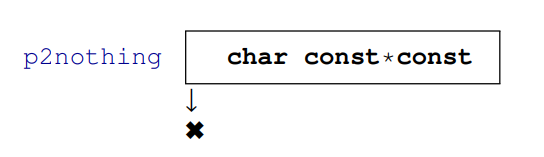
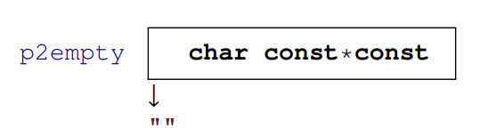
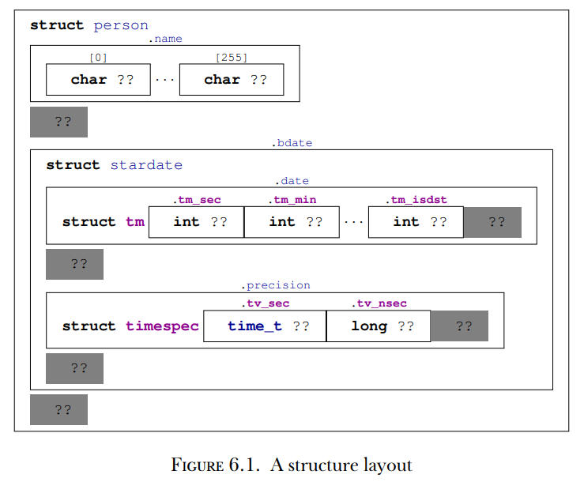

# **Capítulo 6 - Tipos derivados**

Esta seção abrange:

* Agrupar objetos em matrizes
* Usar pointers como tipos opacos
* Combinar objetos em estruturas
* Dar novos nomes a tipos com typedef

Todos os outros tipos de dados em C são derivados dos tipos básicos que, agora, conhecemos. Existem quatro estratégias para derivar tipos de dados. Duas delas são chamadas tipos de dados agregados pois combinam várias instâncias de um ou mais outros tipos de dados:

**Matrizes**(Arrays): Combinam items que tem o mesmo tipo base

**Estruturas**(Structures): Combinam items que podem ter tipos base diferentes

As duas outras estratégias para tipos de dados derivados são mais complexas(involved):

**Pointers**: Entidades que referenciam um objeto na memória. Pointes são, de longe, o conceito mais complicado, com uma discussão mais aprofundada sobre eles sendo deixada apenas para o capítulo 11. Aqui, na seção 6.2, discutiremo-os apenas como tipos de dados opacos, sem mencionar seu propósito real.

**Unions**: Estes juntam (?overlay) items de tipos diferentes no mesmo local de memória. Unions pedem um entendimento mais profundo do modelo de memória em C e não tem muita utilidade no dia-a-dia do programador, sendo introduzidos mais tarde, no capítulo 12.

Existe uma quinta estratégia que introduz novos nomes para tipos: **typedef**. Diferente das quatro anteriores, esta não cria um novo tipo do sistema de tipos de C, apenas cria um novo nome para um tipo ou um conjunto de tipos existente. Desta maneira, é similar à definição de macros com #define, justiifcando a escolha para a palavra chave desse recurso.

## 6.1 Matrizes

Matrizes permitem agrupar objetos do mesmo tipo em um objeto encapsulador. Veremos tipos pointer mais tarde, mas muitas pessoas que iniciam em C se confundem sobre matrizes e pointers. Isto é normal pois ambos são proximamente relacionados em C. Matrizes parecem-se com pointers em muitos contextos, e pointers referenciam objetos de uma matriz. Posteriormente, veremos como ambos conceitos se relacionam, mas por hora, é importante ler essa seção sem preconceitos sobre matrizes; de outro modo, você atrasará sua escalada para um entendimento melhor de C.

6.1.1 Declaração de matrizes

Já vimos como matrizes são declaradas: colocando algo como [N] após outra declaração. Por exemplo:

```
double a[4];
signed b[N];
```

Aqui, `a` comprime 4 subobjetos do tipo double, e `b` comprime N do tipo signed. Pode-se visualizar matrizes com diagramas onde uma matriz é composta por uma sequência de caixas que guardam um item do tipo básico. 

O tipo que compõe uma matriz pode, si próprio, ser uma matriz, formando uma *matriz multidimensional*. As declarações para essas tornam-se um pouco mais difíceis de ler pois [] prende-se à esquerda. As seguintes duas declarações declaram variáveis exatamente do mesmo tipo:

```
double C[M][N];
double (D[M])[N];
```

Ambos C e D são M objetos do tipo matriz de tipo double[N]. Isto significa que temos que ler uma declaração de matrizes aninhada de dentro para fora para descrever sua estrutura. 

Também vimos como elementos matriciais são acessados e inicializados, novamente com um par de []. no exemplo anterior, a[0] é um objeto double e pode ser usado sempre que quisermos usar, por exemplo, uma variável simples. Como vimos, C[0] é, si própria, uma matriz, e C[0][0], que é equivalente a (C[0])[0], é também um objeto double.

Inicializadores podem usar inicializadores designados (também com a notação []) para escolher a posição específica que uma inicialização aplica. O código de exemplo na listagem 5.1 (no livro) contém estes tipos de inicializadores. Durante desenvolvimento, inicializadores designados ajudam a tornar o código robusto contra pequenas alterações em tamanhos ou posições de matrizes.

6.1.2 Operações de matrizes

Matrizes são, simplesmente, objetos de um tipo diferente do que vimos até aqui. *Uma matriz em uma condição é avaliada como true*. IIsto decorre da operação de decaimento matricial que veremos posteriormente. Outra propriedade importante é que não podemos avaliar matrizes como outros objetos. *Existem objetos matriciais, mas não valores matriciais*. Portanto, matrizes não podem ser operandos para os operadores de valores da tabela 4.1, e não existe aritmética declarada nas próprias matrizes. *Matrizes não podem ser comparadas*. Matrizes também não podem estar na posição do valor dos operadores de objeto na tabela 4.2. A maioria dos operadores de objetos são, de maneira similar, barrados de ter matrizes como objetos operandos, seja por eles assumirem aritmética ou por terem um segundo valor operando que teria, também, de ser uma matriz. *Matrizes não podem ser atribuídas a (?arrays can't be assigned to)*. Da tabela 4.2, sabemos agora que apenas 4 operadores restam que funcionam em matrizes como operadores de objetos. Já conhecemos o operador [], e os operadores de decaimento matricial, endereço & e `sizeof` serão introduzidos mais tarde.

6.1.3 Comprimento da matriz

Existem duas categorias de matrizes: matrizes de comprimento constante (CLAs, constant length arrays) e matrizes de comprimento variável (VLAs, variable length arrays). A primeira categoria é um conceito presente em C desde o início, sendo compartilhada com várias outras linguagems de programação. A segunda foi introduzida em C99 e é, relativamente, única de C. Ela possui algumas restrições em sua utilização:

*VLAs podem ter apenas inicializadores padrão(default)*

*VLAs não podem ser declaradas fora de funções*

Portanto, vamos iniciar do lado oposto vendo quais matrizes são, de fato, CLAs (no livro está FLA), de modo que não caiam nessas restrições.

*O comprimento de uma CLA é determinado por uma expressão inteira constante ou por um inicializador*

*Uma especificação de comprimento matricial deve ser, estritamente, positiva.*

Outro caso especial importante leva a uma CLA: quando não há nenhuma especificação de comprimento. Se as chaves [] são deixadas vazias, o comprimento da matriz é determinado de seu inicializador, se houver:

```
double E[] = {[3] = 42.0, [2] = 37.0,};
double F[] = {22.0, 17.0, 1, 0.5, };
```

Neste caso, ambos E e F são do tipo double[4]. Como tais estruturas de inicialização podem sempre ser determinadas na hora da compilação sem, necessáriamente, conhecer-se os valores dos items, a matriz ainda é uma CLA. Quaisquer outras declarações de matrizes levam a VLAa.

*Se o comprimento não é uma ICE (integer constant expression), uma matriz é uma VLA.*

O status de VLAs tem mudado na história de C foram introduzidos como obrigatórios em C99, passando para opcionais em C11. Para C23, VLA dessa forma são opcionais para objetos automáticos (consultados com a macro __STDC_NO_VLA__), mas seus tipos, pointers a eles, e portanto parâmetros do VLA são obrigatórios novamente.

O comprimento de uma matriz pode ser computado através do operador `sizeof`. Este operador fornece o tamanho de qualquer objeto, de modo que o comprimento de uma matriz pode ser calculado com uma divisão simples. (O operador sizeof tem duas formas sintáticas diferentes: se aplicado a um objeto, como neste caso, não precisa de parênteses, mas se aplicado a um tipo precisa)

*O comprimento de uma matriz A é (sizeof A)/(sizeof A[0]).*

Isto é, é o tamanho da matriz inteira dividido pelo tamanho de um elemento qualquer da matriz.

6.1.4 Matrizes como parâmetros

Outro caso especial ocorre para matrizes como parâmetros de funções. Como vimos para o protótipo de printf, estes parâmetros podem ter [] que faz com que pareçam-se com matrizes. Por não podermos produzir valores matriciais, parâmetros matriciais não podem ser passados por valor, e, portanto, não fariam muito sentido dessa forma. Poro isso, estes parâmetros perdem informação e comportam-se bem diferente do que poderia-se imaginar.

*A dimensão mais interna de um parâmetro matricial para uma função é perdida.*

*Não use o operador sizeof em parâmetros matriciais de funções.*

*Parâmetros matriciais comportam-se como se a matriz é passada por referência.*

Por enquanto, neste ponto, deve-se apenas aceitar esses fatos como são; o mecanismo pode apenas ser entendido completamente após a introdução de pointers.

Listing 6.1 Uma função com parâmetros matriciais
```
#include <stdio.h>

void swap_double(double a[static 2]) {
    auto tmp = a[0];
    a[0] = a[1];
    a[1] = tmp;
}
int main(void) {
    double A[2] = {1.0, 2.0, };
    swap_double(A);
    printf("A[0] = %g, A[1] = %g\n", A[0], A[1]);
}
```

Neste programa, swap_double(A) atuará diretamente na matriz A e não em uma cópia dela. Portanto, o programa trocará os valores dos dois elementos de A.

6.1.5 Strings são especiais

Existe um tipo especial de matriz que já encontramos várias vezes e que, diferente de outras matrizes, também tem literais: *strings*.

*Uma string é uma matriz encerrada em 0 de elementos do tipo char.*

Isto é, uma string como "hello" sempre tem um ou mais elementos visíveis, que contém o valor 0, de modo que a matriz tem o comprimento 6. Como todas as matrizes, strings não podem ser atribuídas a (assigned to), mas podem ser inicializadas de literais de string:

```
char jay0[] = "jay";
char jay1[] = { "jay" };
char jay2[] = { 'j', 'a', 'y', 0, };
char jay3[4] = { 'j', 'a', 'y', };
```

Todas essas declarações são equivalentes. Mas cuidado pois nem todas as matrizes de char são strings, como:

```
char jay4[3] = { 'j', 'a', 'y', };
char jay5[3] = "jay";
```

Ambas encerram após o caractere 'y', então não terminam em 0.

Vimos, rapidamente, o tipo base char de strings entre os tipos inteiros. É um tipo estreito que pode ser usado para codificar todos os caracteres do *conjunto de caracteres básico*. Este conjunto de caracteres contém todos os caracteres do alfabeto latino, dígitos arábicos, e caracteres de pontuação que usamos para programar em C. Geralmente, não contém caracteres especiais (como ä, á) ou caracteres de sistemas de escrita completamente diferentes. 

A grande maioria das plataformas hoje usa ASCII (American Standard Code for Information Interchange) para codificar caracteres no tipo char. Tudo feito em C e sua biblioteca padrão usam esta codificação de forma transparente.

Para lidar com matrizes de char e strings existem várias funções na biblioteca padrão que vem com o cabeçalho <string.h>. Aquelas que requerem apenas um argumento matricial iniciam seus nomes com `mem`, e as que também precisam que seus argumentos sejam strings iniciam com `str`. O programa 6.2 usa algumas das funções descritas a seguir.

Listing 6.2 Utilização de algumas funções de string
```
#include <string.h>
#include <stdio.h>

int main(int argc, char* argv[argc+1]) {
    size_t const len = strlen(argv[0]); //Computa o comprimento

    char name[len+1] = { };

    // Copia o nome do programa
    memcpy(name, argv[0], len);
    if (!strcmp(name, argv[0])) {
        printf("program name \"%s\" successfully copied\n", name);
    } else {
        printf("Copying %s leads to different string %s\n", argv[0], name);
    }
}
```

Funções que operam em matrizes de char são:

* memcpy(target, source, len): pode ser usada para copiar uma matriz(source, fonte) para outra(target, alvo). Elas devem ser matrizes diferentes. O números de chars a ser copiado deve ser dado como o terceiro argumento len.
* memcmp(s0, s1, len): compara duas matrizes em ordem lexicográfica. Isto é, primeiro escaneia os segmentos iniciais das duas matrizes que coincidem e retorna a diferença entre os dois primeiros caracteres que são diferentes. Se nenhum elemento diferente é encontrado até o tamanho len, retorna 0.
* memchr(s, c, len): procura a matriz s pelo caractere c.

Em seguida, são funções que operam em strings:

* strlen(s): retorna o comprimento da string s. Ele é simplesmente a posição do primeiro caractere 0 e **não** o comprimento da matriz. É seu dever garantir que s é, de fato, uma string: que encerra em 0.
* strcpy(target, source): similar a memcpy. Copia apenas até o comprimento da string de source, e, portanto, não precisa do argumento len. Novamente, source deve ser uma string (encerrada com 0). Além dissoo, target deve ser grande o suficiente para armazenar a cópia.
* strdup(source) e strndup(source, len) (desde C23): funciona de forma parecida com strcpy, mas primeiro guardam espaço para a cópia. Veremos muito à frente, na seção 13.1, como tal alocação de memória funciona. Novamente, para strdup, o argumento source deve terminar com 0; para strndup, esta exigência é um pouco afrouxada pois a função nunca lerá além do caractere len da fonte.
* strcmp(s0, s1): compara duas matrizes na ordem lexicográfica, similar a memcmp, mas pode não levar em conta algumas especializações do ambiente de linguagem, por exemplo, em qual posição do alfabeto o caractere ä está. A comparação encerra no primeiro caractere 0 que é encontrado, seja em s0 ou s1. Novamente, ambos parâmetros devem encerrar com 0.
* strcoll(s0, s1): compara duas matrizes em ordem lexicográfica, respeitando configurações de linguagem do ambiente específicas. Aprenderemos como configurar isto apropriadamente na seção 8.7.
* strchr(s, c): é similar a memchar, mas a string s deve encerrar em 0.
* strspn(s0, s1): retorna o comprimento do segmento inicial em s0 que consiste nos caracteres que também aparecem em s1.
* strcspn(s0, s1): retorna o comprimento do segmento inicial em s0 que consiste nos caracteres que não aparecem em s1.

*Usar uma função de string em não-strings leva a falha no programa.*

Na vida real, sintomas comuns de utilização equivocada incluem:

* Tempos de execução elevados de strlen ou funções de escaneamento similares por não encontrarem o caractere 0.
* Violações de segmentação pois tais funções tentam acessar elementos após o limite do objeto matricial.
* Corrupção aparentemente aleatória de dados pois as funções escrevem dados em locais onde não deveriam.

Em outras palavras, tenha cuidado e garanta que suas strings são, de fato, strings. SE conhecer o comprimento da matriz de caracteres, mas não sabe se encerra com 0, memchr e aritmética de pointers(capítulo 11) podem ser usado como uma substituição segura para strlen. De forma análoga, se não sabe-se se uma matriz de caracteres é uma string, é melhor copiá-la usando memcpy.

Na discussão até aqui, foram escondidos detalhes importantes: os protótipos das funções. Para as funções string, eles podem ser escritos como:

```
size_t  strlen(char const s[static l]);
char*   strcpy(char target[static l], char const source[static l]);
char*   strdup(char const s[static l]);
char*   strndup(char consts[static l], size_t n);
signed  strcmp(char const s0[static l], char const s1[static l]);
signed  strcoll(char const s0[static l], char const s1[static l]);
char*   strchr(const char s[static l] int c);
size_t  strspn(const char s1[static l], const char s2[static l]);
size_t  strcspn(const char s1[static l], const char s2[static l]);
```

Além do tipo de retorno bizarro de strcpy, strchr, strdup e strndup, estes protótipos parecem razoáveis. Os parâmetros matriciais são matrizes de comprimento desconhecido, de modo que [static l] corresponde a matriz de, pelo menos, um char. strlen, strspn e strcspn retornarão um tamanho, e strcmp retornará um valor negativo, 0 ou um valor positivo de acordo com a ordem dos argumentos.

As coisas ficam mais complicadas ao olhar as declarações de funções matriciais

```
void* memcpy(void* target, void const* source, size_t len);
signed memcpy(void const*, void const* s1, size_t len);
void* memchr(const void *s, int c, size_t n);
```

Ainda falta conhecimento sobre entidades que são especificadas como void*. Eles são *pointers* de objetos e um tipo desconhecido. Apenas no capítulo 11 veremos porque e como esses novos conceitos de pointers e tipo void ocorrem.

## 6.2 Pointers como tipos opacos

Já vimos o conceito de pointers aparecer em vários lugares, em particular como um argumento void* e tipo de retorno e como char const * const para manipular referências para literais de string. Sua propriedade principal é que eles não contém diretamente a informação de interesse; em vez disso, referenciam, ou *apontam*, para o dado. A sintaxe de C para pointers sempre possui o asterisco *:

```
char const*const p2string = "some text";
```

Nesta primeira exploração, apenas temos que conhecer algumas propriedades simples de pointers. A representação binária de um pointer é completamente dependente da plataforma e não nos interessa.

*Pointers são objetos opacos*. Isto significa que apenas seremos capazes de lidar com pointers através de operações que a linguagem C permite para eles. Como dito, a maioria dessas operações serão introduzidas posteriormente, aqui vamos precisar somente de inicialização, atribuição e avaliação.

Uma propriedade particular de pointers que os distingue de outras variáveis é seu estado. *Pointers são válidos, nulos (null) ou inválidos*. Por exemplo, a variável p2string acima é sempre válida pois aponta para o literal de string "some text". Devido à segunda palavra chave const, esta associação jamais poderá ser alterada.

*Inicialização ou atribuição com **nullptr** torna um pointer nulo.* Veja o seguinte exemplo:

```
char const*const p2nothing = nullptr;
```

Visualizamos esta situação especial como:



Note a diferença com uma string vazia:

```
char const*const p2empty = "";
```



Geralmente, refere-se a pointers no estado null como *null pointer*.

*Em expressões lógicas, pointers avaliam como **false** se forem null.* Preste atenção que tais testes não distinguem pointers válidos de inválidos. Assim, o estado realmente "mal" de um pointer é inválido, pois é um estado não-observável:

*Pointers inválidos levam e falhas de programa.*

Por exemplo, um pointer inválido pode ser criado como:

```
char const*const p2invalid;
```

Por não ser inicializado, seu estado é indeterminado. Qualquer avaliação levaria a um valor inválido e deixaria seu programa em um estado indefinido. Portanto, se não houver garantias que um pointer seja válido, **devemos**, pelo menos, garantir que seja colocado como null. *Sempre inicialize pointers.*

## 6.3 Estruturas

Matrizes combinam vários objetos do mesmo tipo base em um objeto maior. Isto é completamente razoável onde queremos combinar informações para as quais a noção de um primeiro, segundo, ... elemento é aceitável. Se não é, ou se temos de combinar objetos de tipos diferentes, entrão *estruturas*(**STRUCT**ures), através da palavra chave `struct`, são utilizadas.

6.3.1 Estruturas simples para acessar campos por nome

Como um primeiro exemplo, vamos revisitar os corvídeos da seção 5.6.2. Lá, usamos um truque com um tipo enumeração para rastrear nossa interpretação dos elementos individuais de um nome de matriz. Estruturas de C permitem uma abordagem mais sistemática ao dar nomes a *membros*(ou *campos*) em um agregado:

```
struct birdStruct {
    char const* jay;
    char const* magpie;
    char const* raven;
    char const* chough;
};
struct birdStruct const aName = {
    .chough = "Henry",
    .raven = "Lissy",
    .magpie = "Frau",
    .jay = "Joe",
};
```

Isto é, das linhas 1 a 6 declaramos um novo tipo denotado por `struct birdStruct`. Esta estrutura tem quatro membros, cujas declarações parecem exatamente como declarações de variáveis comuns. Então, em vez de declarar quatro elementos que são conectados em uma matriz, aqui nomeamos os diferentes membros e declaramos tipos para eles. Tais declarações de um tipo estrutura apenas explica o tipo; não é (ainda) a declaração de um objeto daquele tipo e, menos ainda, uma definição para tal objeto.

Em seguida, na linha 7, declaramos e definimos uma variável (chamada `aName`) do novo tipo. No inicializador e em usos posteriores, os membros individuais são designados usando uma notação com um ponto (.). Em vez de bird[raven] para uma matriz, como na seção 5.6.1, usamos aName.raven para a estrutura.

Note que neste exemplo, os membros individuais, novamente, apenas referenciam as strings. Por exemplo, o membro aName.magpir referencia uma entidade "Frau" que está localizada fora da estrutura, não sendo considerada parte da `struct` em si.

Para um segundo exemplo, vamos olhar uma maneira de organizar estampas temporais. Tempo de calendário é uma maneira complicada de contar, em anos, meses, dias, minutos, e segundos; os diferentes períodos temporais como meses e anos tem comprimentos diferentes, e assim por diante. Uma forma possível de organizar tais dados para os 9 tipos de dados diferentes que precisamos para tais estampas temporais poderia ser uma matriz:

```
typedef int calArray[9];
```

A utilização deste tipo matriz seria ambíguo: armazenaríamos o ano no elemento [0] ou [5]? Para evitar tais ambiguidades, poderíamos certamente usar, novamente, nosso truque com uma `enum`. Mas o padrão C escolheu uma forma diferente. Em <time.h>, ele usa um `struct` que é similar ao seguinte:

```
struct tm{
    int tm_sec;     // Segundos após o minuto       [0, 60]
    int tm_min;     // Minutos após a hora          [0, 59]
    int tm_hour;    // Horas desde a meia-noite     [0, 23]
    int tm_mday;    // Dia do mês                   [0, 31]
    int tm_mon;     // Meses desde Janeiro          [0, 11]
    int tm_year;    // Anos desde 1900
    int tm_wday;    // Dias desde Domingo           [0, 6]
    int tm_yday.    // Dias desde Janeiro           [0, 365]
    int tm_isdst    // Bandeira de Horas de Economia de Luz
};
```

Este `struct` tem *membros nomeados*, como tm_sec, para os segundos, tm_year para o ano etc. Codificar uma data, como a data de escrita, é relativamente simples:

```
struct tm today = {
    .tm_year = 2026-1900,
    .tm_mon = 3-1,
    .tm_mday = 13,
    .tm_hour = 16,
    .tm_min = 41,
    .tm_sec = 47,
};
```

Isto cria uma variável do tipo struct tm e inicializa seus membros com os valores apropriados. A ordem ou posição dos membros na estrutura não é, normalmente, importante. Usar o nome do elemento precedido por um ponto é suficiente para especificar onde o dado correspondente deve ir.

Acessas os membros da estrutura é tão simples quanto, possuindo a sintaxe de ponto similar:

```
printf("este ano é %d, próximo ano será %d\n",
        today.tm_year+1900m today.tm_year+1900+1);
```

Uma referência a um membro como today.tm_year pode aparecer em uma expressão como qualquer variável do mesmo tipo base. 

Existem outros três membros em struct tm que não mencionamos em nossa lista de inicialização: tm_wday, tm_yday e tm_isdst. Como não os definimos, eles são automaticamente definidos como 0.

*Inicializadores de structs omitidos definem o membro correspondente como 0.*

Isto permite até o extremo onde nenhum dos membros é inicializado. Então, quando inicializamos o struct tm como fizemos aqui, a estrutura de dados não é consistente; os membros tm_wday e tm_yday não tem valores que corresponderiam aos valores dos demais membros. Uma função que define este membro como um valor consistente com os outros poderia ser algo como:

```
struct tm time_set_yday(struct tm t) {
    // tm_mdays iniciam em 1
    t.tm_yday += DAYS_BEFORE[t.tm_mon] + t.tm_mday - 1;
    // leva em conta anos bissextos
    id ((t.tm_mon > 1) && leapyear(t.tm_year+1900))
        ++t.tm_yday;
    return t;
}
```

Ela usa o número de dias dos meses precedentes ao atual, o membro tm_mday e o fator corretivo eventual considerando anos bissextos para computar o dia no ano. Esta função tem uma particularidade que é importante no nosso nível atual: ela modifica apenas o membro do parâmetro da função, t, e não o objeto original.

*Parâmetros de struct são passados por valor.*

Para manter as mudanças, temos de reatribuir o resultado da função ao original:

```
today = time_set_yday(today);
```

Mais tarde, ao estudar os tipos pointer, veremos como superar esta restrição para funções. Aqui, vemos que o operador atribuição = é bem definido para todos os tipos estrutura. Infelizmente, suas contrapartidas para comparação não são.

*Estruturas podem ser atribuídas(=).*
*Estruturas não podem ser comparadas com == nem !=.*

A listagem 6.3 mostra o código completo para o uso da struct tm. Ele não contém uma declaração do struct tm histórico pois isto é fornecido através do cabeçalho padrão <time.h>. Hoje em dia, os tipos para membros individuais provavelmente seriam escolhidos de forma diferente. Mas muitas vezes em C temos de manter as decisões de design que foram feitas no passado.

*O layout de uma estrutura é uma decisão de design importante*


6.3.2 Estruturas com campos de diferentes tipos

Outra aplicação de struct é agrupar objetos de tipos diferentes em um objeto maior envolvendo-os. Novamente, para manipular tempos com uma granularidade de nanosegundos, o padrão C já fez a escolha:

```
struct timespec {
    time_t tv_sec;      // Segundos inteiros >= 0
    long tv_nsec;       // Nanosegundos         [0, 9999999999]
};
```

Aqui, vemos o tipo opaco time_t que já encontramos na seção 5.2 para os segundos, e um long para os nanosegundos. Novamente, as razões dessa escolha são históricas: hoje em dia, os tipos escolhidos poderiam ter sido diferentes. Para computar a diferença entre dois tempos struct timespec, podemos definir uma função facilmente.

Enquanto a função difftime é parte do padrão C, tal funcionalidade aqui é muito simples, não baseada em propriedades específicas de plataforma. Assim, pode ser facilmente implementada por quem precisar.

6.3.3 Estruturas aninhadas

Qualquer tipo de dado fora uma matriz de comprimento variável é permitido como membro em uma estrutura. Assim, estruturas podem ser aninhadas no sentido que um membro de uma estrutura pode, também, ser (outro) tipo struct, e a estrutura menor pode até ser declarada dentro da maior:

```
struct person {
    char name[256];
    struct stardate {
        struct tm date;
        struct timespec precision;
    } bdate;
};
```

Uma visão estrutural é mostrada na figura 6.1 AS caixas cinzas correspondem a um possível preenchimento (padding), um conceito que veremos na discussão na sequência.



De forma bem diferente que para outras linguagens de programação, como C++, a visibilidade da declaração struct stardate é a mesma que para struct person. Um struct (nesse exemplo, person) não define um novo escopo para um outro struct (aqui, stardate) que seja definido dentro das chaves {} da declaração do struct externo. Isto é, se as declarações struct aninhadas aparecerem globalmente, ambos structs são visíveis globalmente no arquivo C. Se aparecerem dentro do corpo de uma função, sua visibilidade fica ligada à declaração composta {} na qual são encontrados.

Portanto, uma versão mais adequada seria:

```
struct stardate {
    struct tm date;
    struct timespec precision;
};
struct person {
    char name[256];
    struct stardate bdate;
};
```

Nesta versão, todos os structs são colocados no mesmo nível pois, no final das contas, seu acabam tendo o mesmo escopo. Entretanto, isso não alteraa visualização estrutural apresentada na Figura 6.1.

6.3.4 Campos de estrutura coalescente

Já vimos que o compilador coloca os campos de uma estrutura na mesma ordem no armazenamento em que são definidas. Se os campos tem tamanhos diferentes, o compilador pode querer colocá-las em posições específicas da estrutura. A razão principal disso é a facilidade de acesso desse tais campos; devido à organização do armazenamento em palavras que contem diversos bytes, poderia ser melhor iniciar um novo campo no limite de tal palavra. Veremos esse recurso, chamado alinhamento, na seção 12.7. O alinhamento pode levar a algum espaço desperdiçado após qualquer campo, chamado enchimento de bytes (byte padding), as áreas cinzas do esquema da figura 6.1. Se existem, esses enchimentos sempre consistirão de 1  ou vários bytes.

Uma das possibilidades para reduzir o desperdício é escolher um ordenamento específico dos membros. 

Outro possível disperdício de bits e bytes em nossa estrutura pode originar do uso ineficiente. Lembre-se que usamos valores sem sinal para representar conjuntos de pássaros. Efetivamente, precisávamos apenas de 4 bits dentro do unsigned; todos os outros bits foram desperdiçados. Este fenômeno é chamado *enchimento de bits*(bit padding) pois, diferente do byte padding, em geral, não cai nos limites de bytes e pode ir até bits individuais.

Este desperdício é bastante alto na estrutura predefinida tm. Por exemplo, um campo como tm_sec tem apenas 61 valores possíveis, sendo possível armazená-lo em 6 bits em vez dos, pelo menos, 16 bits que compõe um número int. Tradicionalmente, C tem um mecanismo chamado campo de bit(bit-field) que pode ser usado para reduzir os bits que um membro de uma estrutura ocupa:

```
// *** Possui erros, não use isso! ***
struct tib {
    int tib_sec     :6;     // segundos
    int tib_min     :6;     // minutos
    int tib_hour    :5;     // horas
    int tib_mday    :5;     // dia do mês
    int tib_mon     :4;     // mes
    int tib_year;           // ano
    int tib_wday    :3;     // dia da semana
    int tib_yday    :9;     // dia do ano
    int tib_isdst   :1;     // daylight saving time
};
```

Isto é, colocamos o número de bits que precisamos após a declaração do membro, separado pelo caractere dois pontos :. Assim, nesse caso, indicamos que precisamos de, pelo menos, 39 bits para os campos de bits (além de sizeof(int)*CHAR_BIT bits para o int) para representar todos os valores que nos interessam. Então, o compilador deve organizar a estrutura coalescendo os campos de bit sucessivos em unidades maiores. Um esquema comum aqui poderia ser agrupar os primeiros 5 campos com seus 28 bits em uma unidade do tamanho de um int, e deixar tib_year em um int separado, tendo então outra unidade para os 13 bits finais. Em vez de 9 * sizeof(int), este esquema usa apenas 3 * sizeof(int), três vezes menos.

Tudo isso ainda é usado como antes, um designador x.tib_year pode ser usado em expressões ou em atribuições como o correspondente em struct tm, e inicializadores como .tib_mon=3 funcionam como esperado.

Mas os campos de bit tradicionais, apresentados anteriormente, tem alguns problemas e, portanto, o código que é mostrado aqui pode ser incorreto. Primeiro, a especificação de int para um campo de bits pode corresponder a um tipo signed ou unsigned. Em algumas arquiteturas, onde int como aqui significa unsigned, o código está, de fato, correto. Na (maioria) das arquiteturas onde o campo é signed, falta um bit para a representação da maioria dos campos. Por exemplo, se o campo tib_mday tem 5 bits e é signed, pode armazenar os valores -16, ..., 15. Uma atribuição como x.tib_mday = 31 tem um valor fora dessa faixa.

Esta falha de concepção (design) pode ser evitada revisitando a especificação. Poderíamos aumentar todas as especificações acrescentado 1 bit de sinal. Mas então para nosso exemplo, os 5 primeiros campos já precisariam de 33 bits e, na maioria das arquiteturas, não poderá armazenar em uma única unidade. A outra possiblidade é usar unsigned para todos os campos de bits, que é o mais recomendado.

Também existe um segundo problema a campos-bit nas versões anteriores a C23, que o tipo ao qual um campo-bit resolve em uma expressão (como x.tib_mday) não é suficientemente especificado pelo padrão, e compiladores atualmente divergem. Isto não é algo que se possa observar no nível atual, mas pode atrapalhar muito mais tarde, quando tentarmos inferir tipos para declarações ou chamadas de funções de tipo-genérico no capítulo 18. Com a introdução dos tipos _BitInt, agora podemos escrever:

```
struct tbi {
    unsigned _BitInt (6) tib_sec    :6;
    unsigned _BitInt (6) tib_min    :6;
    unsigned _BitInt (5) tib_hour   :5;
    unsigned _BitInt (5) tib_mday   :5;
    unsigned _BitInt (4) tib_mon    :4;
    unsigned _BitInt     tib_year;
    unsigned _BitInt (3) tib_wday   :3; 
    unsigned _BitInt (9) tib_yday   :9;
    bool                 tib_isdst  :1;
};
```

Aqui, todos os campos-bit tem exatamente o tipo e comportam-se exatamente como especificado. Os tipos que são explicitamente especificados como tipos unsigned comportam-se como tal.

*Use um tipo _BitInt(N) para um campo-bit numério de largura N.*

*Use bool como tipo de um campo-bit de flag de largura 1.*

## 6.4 Novos nomes para tipos: apelidos(aliases) de tipos