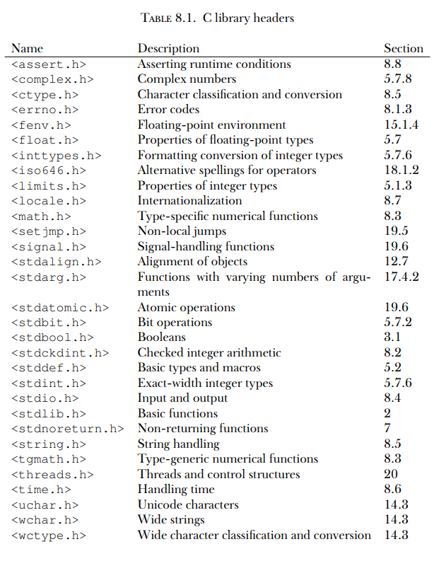
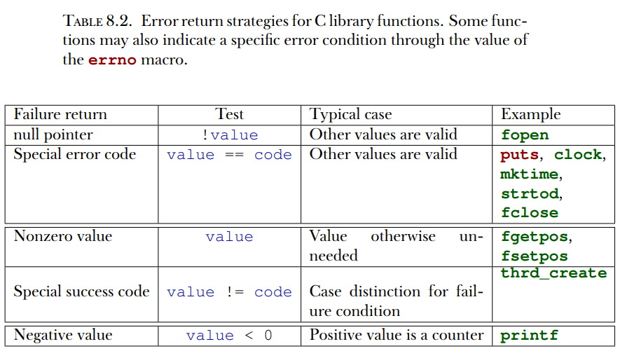
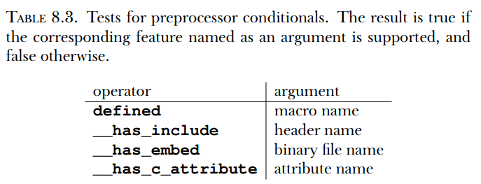

# **Capítulo 8 - Funções da biblioteca C**

Esse capítulo aborda:

    * Fazer matemática, trabalhar com arquivos e processar strings
    * Manipular tempo
    * Gerenciar o ambiente de execução
    * Encerrar programas

A funcionalidade que a biblioteca padrão de C fornece é separada em duas grandes partes. Uma é a linguagem C em si, e a outra a biblioteca C. Já vimos diversas funções que vem dela, como printf, puts, strod. Elas são ferramentas básicas que implementam recursos que precisamos na programação cotidiana e para os quais precisamos de interfaces e semântica claras para garantir portabilidade.

Em várias plataformas, a especificação clara através de um interface de programação de aplicativo(API) também permite-nos separar a implementação do compilador da implementação da biblioteca. Por exemplo, em sistemas Linux, podemos escolher diferentes compiladores, com os mais comuns sendo gcc, clang e musl.

Começaremos discutindo as propriedades e ferramentas gerais da biblioteca C e suas interfaces, para então descrever alguns grupos de funções: funções matemáticas (numéricas), funções de entrada/saída(input/output), processamento de strings, lidar com tempos, acesso ao ambiente de execução (runtime) e encerramento de programas.

## 8.1 Propriedades gerais da biblioteca C e suas funções

De modo geral, funções de bibliotecas tem como objetivo um ou dois propósitos:

*Camada de abstração da plataforma*: Funções que abstraem das propriedades e necessidades específicas da plataforma. Elas são funções que precisam de bits específicos da plataforma para implementar operações básicas como IO, que não poderiam ser implementadas sem um conhecimento profundo da plataforma. Por exemplo, `puts` precisa ter algum conceito de um "terminal de saída" e como tratá-lo (address it). Implementar essas funcionalidades excederia o conhecimento da maioria dos programadores C pois fazer isso requer conhecimento específico do OS ou mesmo do processador.

*Ferramentas básicas*: Funções que implementam uma tarefa (como `strtod`) que frequentemente ocorre em programação em C e para a qual é importante que a interface seja fixa. Elas deveriam ser implementadas relativamente eficientemente pois são usadas bastante, e deveriam ser bem testadas e livre de bugs para que possamos confiar nelas de forma segura. Implementar tais funções deveria, em princípio, ser posível para qualquer programador C confirmado.

Uma função como `printf` pode ser vista como visando ambos propósitos. Existe uma função snprintf (explicada muito mais à frente, no capítulo 14.1), que fornece as mesmas funcionalidades de formatação que printf mas guarda o resultado em uma string. Esta string poderia, então, ser exibida com puts para ter-se a mesma saída de printf como um todo.

8.1.1 Headers

A biblioteca C tem muitas funções. Um arquivo de cabeçalho (header) junta descrições de interface para um número de recursos, na maioria funções. Os arquivos cabeçalho que discutiremos aqui fornecem recursos da biblioteca C, mas poderemos, mais tarde, criar nossas próprias interfaces e agrupá-las em cabeçalhos (capítulo 10).

Aqui apenas discutiremos as funções da biblioteca C que são necessárias para programação básica com os elementos da linguagem que já vimos até aqui. Completaremos esta discussão mais à frentem, após vermos vários outros conceitos. A tabela 8.1 dá uma visão geral dos arquivos de cabeçalho padrão.



8.1.2 Interfaces

A maioria das interfaces da biblioteca C são especificadas como funções, mas as implementações são livres para escolher implementá-las como macros, onde fazer isso seja apropriado. Comparado com o visto na subseção 5.6.3, isto usa uma segunda forma de macros que é sintáticamente similar a funções, macros tipo-função:

```
#define putchar(A) putc(A, stdout)
```

Como antes, isso é apenas subsituições textuais, e como o texto de subsituição pode conter um argumento macro muitas vezes, seria ruim passar qualquer expressão com efeitos colaterais para tais macros ou funções. Algumas das interfaces que veremos tem argumentos ou valores de retorno que são pointers. Não podemos lidar com eles completamente ainda, mas na maioria dos casos, podemos passar pointers conhecidos ou nullptr para argumentos pointer. Pointers como valores de retorno somente ocorrerão em situações onde eles podem ser interpretados como uma condição de erro.

8.1.3 Checagem de erros

As funções da biblioteca C geralmente indicam falha através de um valor de retorno especial. Qual valor indica a falha pode ser diferente e depende da própria função. Normalmente, você precisa olhar a convenção específica no manual da função. A tabela 8.2 dá uma visão geral das possibilidades. Existem três categorias: um valor especial que indica um erro, um valor especial que indica sucesso, e funções que retornam algum tipo de contador positivo no sucesso e negativo na falha.



Uma checagem de erros típica pode ser como o seguinte:

```
if (puts("hello world") == EOF) {
    perror("can't output to terminal: ")
    exit(EXIT_FAILURE);
}
```

Aqui vemos que puts entra na categoria de funções que retornam um valor especial no erro, EOF ("end of file"). A função perror de <stdio.h> é, então, usada para fornecer um diagnóstico adicional que depende do erro específico. exit finaliza a execução do programa. *Falha é sempre uma opção.* *Cheque o valor de retorno de funções da biblioteca para erros.* *Falhe rápido, falhe cedo e falhe bastante.* Uma falha imediata do programa costuma ser a melhor forma de garantir que bugs sejam detectados e consertados cedo no desenvolvimento.

C possui uma variável de estado maior que rastreia erros das funções das bibliotecas C: `errno`. A função perror usa este estado debaixo do capô para fornecer seu diagnóstico. Se uma função falhar de uma maneira que nos permite recuperar, precisamos garantir que o estado do erro também é resetado; de outra forma, as funções da biblioteca ou checagem de erros poderiam se confundir:

```
void puts_safe(char const s[static1]) {
    static bool failed = false;
    if (!failed && puts(s) == EOF) {
        perror("can't output to terminal: ");
        failed = true;
        errno = 0;
    }
}
```

8.1.4 Interfaces de checagem de bordas

Muitas das funções da biblioteca C são vulneráveis a transbordamento de buffer se forem chamadas com um conjunto de parâmetros inconsistente. Isto leva a vários bugs de segurança e exploits e é, geralmente, algo que deveria ser lidado com muito cuidado.

C11 abordou este tipo de problema depreciando ou removendo algumas funções do padrão e acrescentando uma série opcional de novas interfaces que checam a consistência dos parâmetros na hora da execução. Essas são as interfaces de checagem de bordas do Anexo K do padrão C. Diferente da maioria dos outros recursos, isto não vem com seu próprio cabeçalho mas acrescenta interfaces a outros. Duas macros regulam acesso a essas interfaces: __STDC_LIB_EXT1__ diz se estas interfaces opcionais tem suporte, e __STDC_WANT_LIB_EXT1__ ativa elas. Esta última precisa ser configurada *antes* de qualquer arquivo de cabeçalho ser incluído.

Este mecanismo era (e ainda é), aberto a muito debate, e portanto anexo K é um recurso opcional. Muitas plataformas modernas conscientemente escolheram não suportá-lo. Existe até mesmo um estudo de 2015 que concluiu que a introdução dessas interfaces criou muito mais problemas do que resolveu.

As funções de checagem de bordas geralmente usam o sufixo _s no nome da função da biblioteca que elas substituem, como printf_s para printf. Se tais funções encontrarem uma inconsistência, uma violação de restrição da hora da execução, normalmente deveria finalizar a execução do programa após exibir um diagnóstico.

8.1.5 Pré-condições da plataforma

Um objetivo importante da programação com uma linguagem padronizada como C é a portabilidade. Deveríamos fazer o mínimo de presunções sobre a plataforma de execução que for possível e deixar ao compilador e biblioteca preencher os vazios. Infelizmente, isto não é sempre uma opção, nesses casos sendo necessário identificar claramente précondições do código.

As ferramentas clássicas para conseguir isso são condicionais de préprocessador, como vimos anteriormente:

```
#if !__STDC_LIB_EXT1__
#   error "This code needs bounds checking interface Annex K"
#endif
```

Como pode ver, tais condicionais começam com a sequência #if em uma linha e encerram com outra linha contendo #endif. A diretiva #error no meio é executada apenas se a condição for verdadeira. Ela aborta o processo de compilação com uma mensagem de erro; uma diretiva #warning similar permite a continuação da compilação mas garante que uma mensagem de atenção seja fornecida. As condições que podemos colocar em tais construtos são limitadas.

*Em um condicional do preprocessador, apenas avalie macros e literais inteiros.*

Como um recurso extra nessas condições, identificadores que são desconhecidos são avaliados para 0. Então, no exemplo anterior, a expressão é válida mesmo se o argumento for desconhecido naquele ponto.

*Em um condicional do preprocessador, identificadores desconhecidos são avaliados como 0.*

Existem operadores especiais nos condicionais de preprocessador que podem consultar capacidades especiais do compilador para ver se recursos específicos estão disponíveis.



O teste `defined` tem, inclusive, atalhos que podem integrar diretamente na sintaxe #:


Se quisermos testar condições mais sofisticadas que não são conhecidas pelo preprocessador mas apenas em fases de compilação subsequentes, static_assert pode ser usado. Aqui, a garantia é que a condição é sempre avaliada na hora de compilação, mas após o pré-processamento:

```
static_assert(sizeof(double) == sizeof(long double),
    "Extra precision needed for convergence.");
```

Antes de C23, a palavra chave era escrita _Static_assert, e static_assert estava disponível de uma macro de <assert.h>;

## 8.2 Aritmética de inteiros